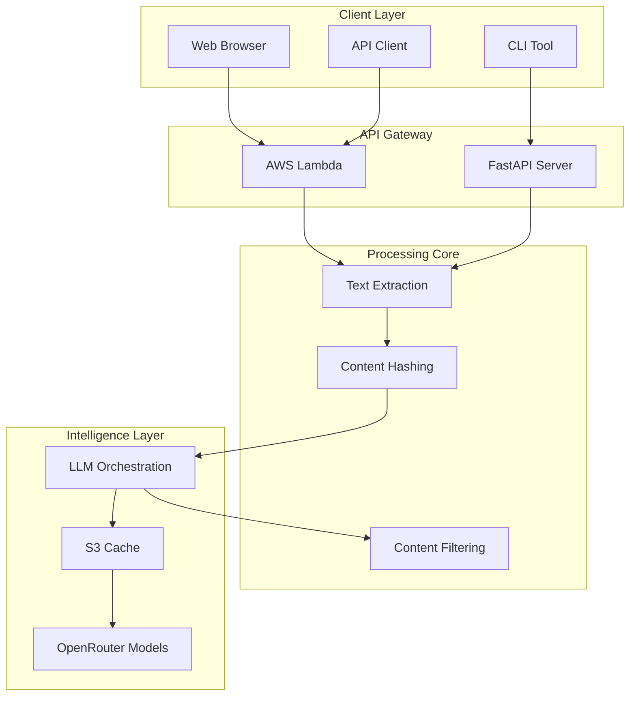

# MGraph-AI Web Content Filtering

[](https://github.com/the-cyber-boardroom/MGraph-AI__Web-Content-Filtering/releases)
[](https://www.python.org/downloads/)
[](https://fastapi.tiangolo.com/)
[](https://aws.amazon.com/lambda/)
[](LICENSE)
[](https://github.com/the-cyber-boardroom/MGraph-AI__Web-Content-Filtering/actions)

## 🎯 Overview

MGraph-AI Web Content Filtering (WCF) is an intelligent content analysis and filtering system that leverages Large Language Models (LLMs) to provide real-time sentiment analysis, topic classification, and dynamic content moderation for web pages. Built on a serverless architecture, it offers scalable, cost-effective content filtering with sub-second response times through intelligent caching.

### Key Capabilities

- 🔍 **Intelligent Text Extraction** - Preserves HTML structure while extracting and hashing text nodes
- 🤖 **Multi-Model LLM Support** - Integrates with 10+ models via OpenRouter (free and paid tiers)
- ⚡ **Smart Caching** - S3-based caching reduces costs by 80% and improves response times
- 🎨 **Flexible Filtering** - Dynamic content moderation based on sentiment thresholds
- 🚀 **Serverless Ready** - Deploy to AWS Lambda with one command
- 📊 **Real-time Analysis** - Process web pages in under 2 seconds

## 🚀 Quick Start

### Installation

```bash
# Clone the repository
git clone https://github.com/the-cyber-boardroom/MGraph-AI__Web-Content-Filtering.git
cd MGraph-AI__Web-Content-Filtering

# Install dependencies
pip install -r requirements.txt

# Set up environment variables
cp .env.example .env
# Edit .env and add your OPEN_ROUTER__API_KEY
```

### Basic Usage

```python
from mgraph_ai_web_content_filtering.wcf__fast_api.core import Html__Extract_Text_Nodes

# Extract and analyze text from a URL
extractor = Html__Extract_Text_Nodes(url="https://example.com")
text_nodes = extractor.extract()

# Generate HTML with sentiment ratings
html_with_ratings = extractor.create_html_with_ratings()

# Filter negative content (rating < 0.3)
filtered_html = extractor.create_html_with_min_ratings(min_rating=0.3)
```

### Run Locally

```bash
# Start the FastAPI server
uvicorn mgraph_ai_web_content_filtering.wcf__fast_api.WCF__Fast_API:app --reload

# Access the API
curl "http://localhost:8000/html-graphs/url-to-ratings?url=https://example.com"
```

## 🏗️ Architecture

### System Overview



### Technology Stack

| Component | Technology | Purpose |
|-----------|-----------|---------|
| **Runtime** | Python 3.12 | Core language |
| **Web Framework** | FastAPI | REST API server |
| **Serverless** | AWS Lambda | Scalable compute |
| **Storage** | AWS S3 | Cache persistence |
| **LLM Integration** | OpenRouter | Multi-model access |
| **Type Safety** | OSBot Type_Safe | Runtime validation |
| **Testing** | Pytest | Test framework |
| **CI/CD** | GitHub Actions | Automated pipeline |

## 📁 Project Structure

```
MGraph-AI__Web-Content-Filtering/
├── mgraph_ai_web_content_filtering/
│   ├── wcf__fast_api/
│   │   ├── core/                  # Core processing components
│   │   │   ├── Html__Transformations.py
│   │   │   └── Html__Extract_Text_Nodes.py
│   │   ├── llms/                  # LLM integration layer
│   │   │   ├── WCF__LLM__Execute_Request.py
│   │   │   ├── WCF__LLM__Cache.py
│   │   │   └── API__LLM__Open_Router.py
│   │   ├── routes/                # API endpoints
│   │   │   └── Routes__Html_Graphs.py
│   │   └── WCF__Fast_API.py      # FastAPI application
│   ├── lambdas/
│   │   └── wcf__handler.py       # Lambda entry point
│   └── utils/
│       ├── deploy/                # Deployment utilities
│       └── testing/               # Test framework
├── docs/                          # 📚 Comprehensive documentation
│   ├── README.md                  # Documentation portal
│   ├── architecture/              # Technical deep dives
│   └── code/                      # Component documentation
├── tests/                         # Test suite
├── requirements.txt               # Python dependencies
└── README.md                      # This file
```

## 🔌 API Endpoints

### Core Endpoints

| Endpoint | Method | Description |
|----------|--------|-------------|
| `/html-graphs/url-to-html` | GET | Fetch raw HTML from URL |
| `/html-graphs/url-to-text-nodes` | GET | Extract text nodes with hashes |
| `/html-graphs/url-to-ratings` | GET | Get sentiment ratings via LLM |
| `/html-graphs/url-to-html-min-rating` | GET | Filter content below threshold |
| `/html-graphs/url-to-html-max-rating` | GET | Filter content above threshold |
| `/html-graphs/url-to-html-topics` | GET | Show topic classifications |

### Example API Calls

```bash
# Get sentiment ratings for a webpage
curl "http://api/html-graphs/url-to-ratings?url=https://news.site.com"

# Filter out negative content (rating < 0.3)
curl "http://api/html-graphs/url-to-html-min-rating?url=https://blog.com&rating=0.3"

# Use a specific LLM model
curl "http://api/html-graphs/url-to-ratings?url=https://example.com&model_to_use=Open_AI__GPT_4o_Mini"
```

## 🚀 Deployment

### Deploy to AWS Lambda

```bash
# Install deployment dependencies
pip install -r requirements-deploy.txt

# Deploy to AWS
python -m mgraph_ai_web_content_filtering.utils.deploy.Deploy__Web_Content_Filtering

# Or use the deployment script
from mgraph_ai_web_content_filtering.utils.deploy import Deploy__Web_Content_Filtering

deployer = Deploy__Web_Content_Filtering()
deployer.deploy()

# Get the Lambda URL
print(f"API URL: {deployer.get_function_url()}")
```

### Configuration

Create a `.env` file with your configuration:

```env
# Required
OPEN_ROUTER__API_KEY=your_api_key_here

# Optional
AWS_REGION=us-east-1
LOG_LEVEL=INFO
CACHE_TTL=86400
```

## 📊 Performance Metrics

| Metric | Value | Description |
|--------|-------|-------------|
| **Text Extraction** | ~100ms | Parse and extract text from HTML |
| **LLM Processing** | 500-2000ms | Sentiment analysis (model dependent) |
| **Cache Hit Rate** | ~80% | Percentage of cached responses |
| **Lambda Cold Start** | ~1.7s | Initial invocation time |
| **Warm Response** | <200ms | Subsequent requests |
| **Cost per 1K requests** | ~$0.02 | Using free tier models |

## 🤖 Supported LLM Models

### Free Tier (Default)
- **Mistral Small** - 96K context, balanced performance
- **Moonshot Kimi K2** - 65K context, fast responses
- **Qwen 235B** - 262K context, large documents

### Premium Tier
- **Google Gemini 2.0** - 1M context, $0.075/M tokens
- **OpenAI GPT-4o Mini** - 128K context, $0.15/M tokens
- **OpenAI GPT-5 Mini** - 400K context, $0.25/M tokens

## 🧪 Testing

```bash
# Run unit tests
pytest tests/unit/

# Run integration tests (requires AWS credentials)
pytest tests/integration/

# Run with coverage
pytest --cov=mgraph_ai_web_content_filtering tests/

# Run specific test file
pytest tests/test_text_extraction.py -v
```

## 📚 Documentation

Comprehensive documentation is available in the [`docs/`](docs/) directory:

- **[Architecture Overview](docs/README.md)** - System design and components
- **[API Reference](docs/code/mgraph_ai_web_content_filtering/wcf__fast_api/routes/Routes__Html_Graphs.py.md)** - Endpoint documentation
- **[Deployment Guide](docs/code/mgraph_ai_web_content_filtering/utils/deploy/Deploy__Web_Content_Filtering.py.md)** - AWS Lambda deployment
- **[Technical Deep Dives](docs/architecture/)** - Algorithm analysis and optimizations
- **[Testing Framework](docs/code/mgraph_ai_web_content_filtering/utils/testing/TestCase__FastAPI__Lambda.py.md)** - Test utilities

## 🔒 Security

- **API Keys**: Stored in environment variables, never in code
- **S3 Encryption**: AES-256 encryption at rest
- **IAM Roles**: Least privilege access control
- **Input Validation**: Type-safe schemas for all inputs
- **Content Sanitization**: XSS prevention in HTML responses

## 🤝 Contributing

We welcome contributions! Please see our [Contributing Guidelines](CONTRIBUTING.md) for details.

1. Fork the repository
2. Create a feature branch (`git checkout -b feature/amazing-feature`)
3. Commit your changes (`git commit -m 'Add amazing feature'`)
4. Push to the branch (`git push origin feature/amazing-feature`)
5. Open a Pull Request

## 📄 License

This project is licensed under the Apache License 2.0 - see the [LICENSE](LICENSE) file for details.

## 🙏 Acknowledgments

- Built with [OSBot](https://github.com/owasp-sbot) utilities
- LLM integration via [OpenRouter](https://openrouter.ai)
- Deployed on [AWS Lambda](https://aws.amazon.com/lambda/)

## 📮 Contact & Support

- **Repository**: [GitHub](https://github.com/the-cyber-boardroom/MGraph-AI__Web-Content-Filtering)
- **Issues**: [GitHub Issues](https://github.com/the-cyber-boardroom/MGraph-AI__Web-Content-Filtering/issues)
- **Organization**: [The Cyber Boardroom](https://github.com/the-cyber-boardroom)

---

*Built with ❤️ by The Cyber Boardroom team*