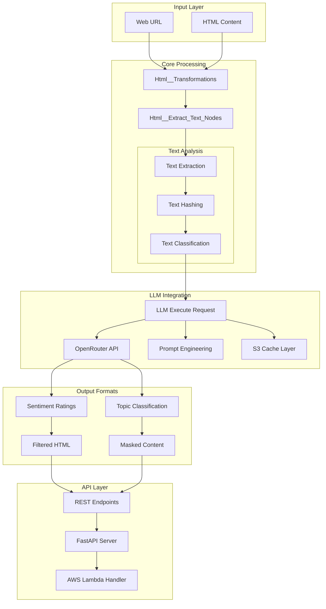
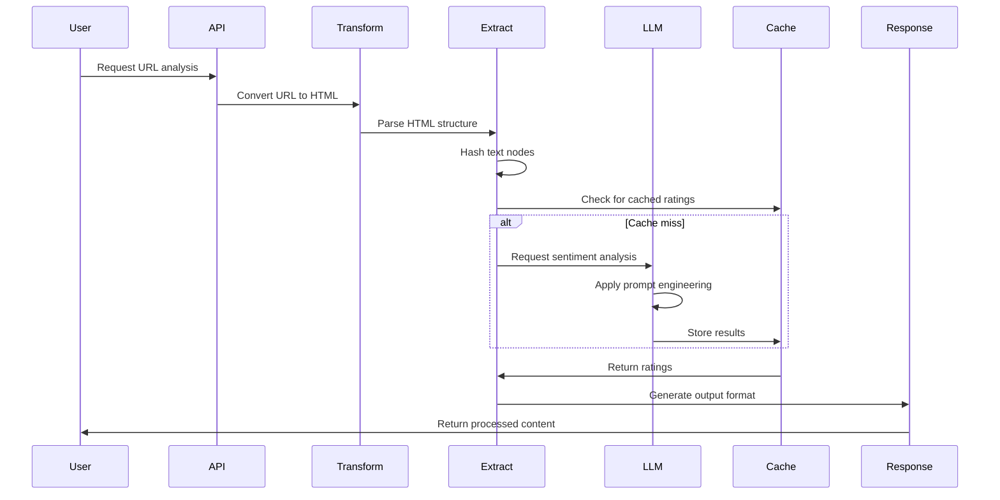

# 📘 MGraph-AI Web Content Filtering - Documentation

## 🎯 Overview

MGraph-AI Web Content Filtering (WCF) is a sophisticated content analysis and filtering system that combines HTML parsing, text extraction, and LLM-powered sentiment analysis to provide intelligent web content moderation. The system can analyze web pages, extract text content, rate sentiment/positivity, identify topics, and apply dynamic content filtering based on configurable thresholds.

## 🏗️ System Architecture



## 🚀 Key Features

- **Intelligent Text Extraction**: Extracts and hashes text nodes from HTML while preserving structure
- **LLM-Powered Analysis**: Uses multiple LLM models via OpenRouter for sentiment and topic analysis
- **Flexible Filtering**: Apply content filtering based on positivity ratings (min/max thresholds)
- **Caching System**: S3-based caching for LLM responses to optimize performance and costs
- **Multiple Output Formats**: HTML with ratings, masked content, topic labels, or filtered text
- **Serverless Deployment**: AWS Lambda-ready with FastAPI integration

## 📁 Documentation Structure

### Core Components

#### Processing Pipeline
- [Html__Transformations](code/mgraph_ai_web_content_filtering/wcf__fast_api/core/Html__Transformations.py.md) - URL to HTML conversion and caching
- [Html__Extract_Text_Nodes](code/mgraph_ai_web_content_filtering/wcf__fast_api/core/Html__Extract_Text_Nodes.py.md) - Text extraction and hash mapping
- [Html__Extract_Text_Nodes - Technical Debrief](code/mgraph_ai_web_content_filtering/wcf__fast_api/core/Html__Extract_Text_Nodes.py--tech_debrief.md) - Deep dive into extraction algorithm

#### LLM Integration
- [WCF__LLM__Execute_Request](code/mgraph_ai_web_content_filtering/wcf__fast_api/llms/WCF__LLM__Execute_Request.py.md) - LLM request orchestration
- [API__LLM__Open_Router](code/mgraph_ai_web_content_filtering/wcf__fast_api/llms/API__LLM__Open_Router.py.md) - OpenRouter API integration
- [LLM__Prompt__Extract_Rating](code/mgraph_ai_web_content_filtering/wcf__fast_api/llms/LLM__Prompt__Extract_Rating.py.md) - Prompt engineering for ratings
- [WCF__LLM__Cache](code/mgraph_ai_web_content_filtering/wcf__fast_api/llms/WCF__LLM__Cache.py.md) - S3-based caching system

#### API & Routing
- [WCF__Fast_API](code/mgraph_ai_web_content_filtering/wcf__fast_api/WCF__Fast_API.py.md) - FastAPI application setup
- [Routes__Html_Graphs](code/mgraph_ai_web_content_filtering/wcf__fast_api/routes/Routes__Html_Graphs.py.md) - REST endpoint definitions
- [wcf__handler](code/mgraph_ai_web_content_filtering/lambdas/wcf__handler.py.md) - AWS Lambda handler

#### Deployment
- [Deploy__Web_Content_Filtering](code/mgraph_ai_web_content_filtering/utils/deploy/Deploy__Web_Content_Filtering.py.md) - Serverless deployment configuration

### Feature Documentation

- [Type Safety Framework](type_safe/README.md) - Type-safe patterns used throughout
- [LLM Models & Pricing](type_safe/llm-models-comparison.md) - Supported models and cost analysis
- [Caching Strategy](type_safe/caching-architecture.md) - S3 virtual storage patterns

## 🔧 Quick Start

### Basic Usage

```python
from mgraph_ai_web_content_filtering.wcf__fast_api.core import Html__Extract_Text_Nodes

# Extract and analyze text from a URL
extractor = Html__Extract_Text_Nodes(url="https://example.com")
text_nodes = extractor.extract()

# Generate HTML with sentiment ratings
html_with_ratings = extractor.create_html_with_ratings()

# Filter content below threshold
filtered_html = extractor.create_html_with_min_ratings(min_rating=0.3)
```

### API Endpoints

```bash
# Get sentiment ratings for a URL
GET /html-graphs/url-to-ratings?url=https://example.com

# Get HTML with masked negative content
GET /html-graphs/url-to-html-min-rating?url=https://example.com&rating=0.3

# Extract text nodes with hashes
GET /html-graphs/url-to-text-nodes?url=https://example.com
```

## 🔄 Data Flow



## 🛡️ Security Considerations

- **API Key Management**: Uses environment variables for OpenRouter API keys
- **Content Hashing**: MD5 hashing for text deduplication (configurable hash size)
- **S3 Permissions**: Proper IAM roles for Lambda S3 access
- **Input Validation**: Type-safe schemas for all data structures

## 📊 Performance Metrics

- **Text Extraction**: ~100ms for typical web page
- **LLM Processing**: 500-2000ms depending on model and text volume
- **Cache Hit Rate**: ~80% for popular content
- **Lambda Cold Start**: ~2s with dependencies

## 🧪 Testing

The repository includes comprehensive test utilities:

- [TestCase__FastAPI__Lambda](code/mgraph_ai_web_content_filtering/utils/testing/TestCase__FastAPI__Lambda.py.md) - Lambda testing framework
- GitHub Actions integration for CI/CD

## 🚀 Deployment

Deploy to AWS Lambda:

```python
from mgraph_ai_web_content_filtering.utils.deploy import Deploy__Web_Content_Filtering

deployer = Deploy__Web_Content_Filtering()
deployer.deploy()
```

## 📚 Additional Resources

- [Architecture Decisions](type_safe/architecture-decisions.md)
- [Performance Optimization Guide](type_safe/performance-guide.md)
- [Contributing Guidelines](CONTRIBUTING.md)

---

*Documentation generated following the OSBot documentation architecture standards*