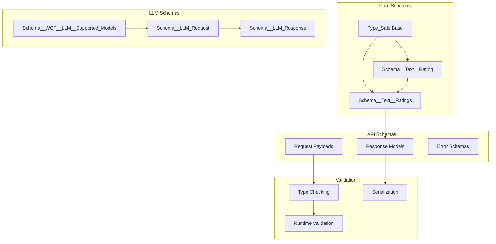
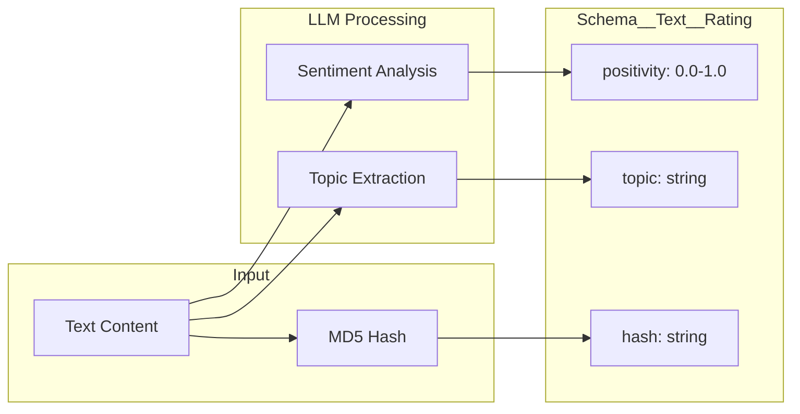
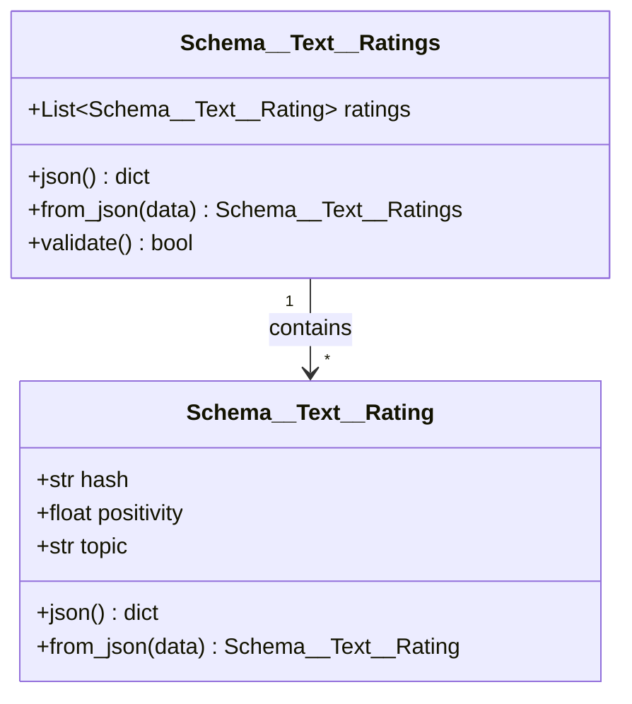
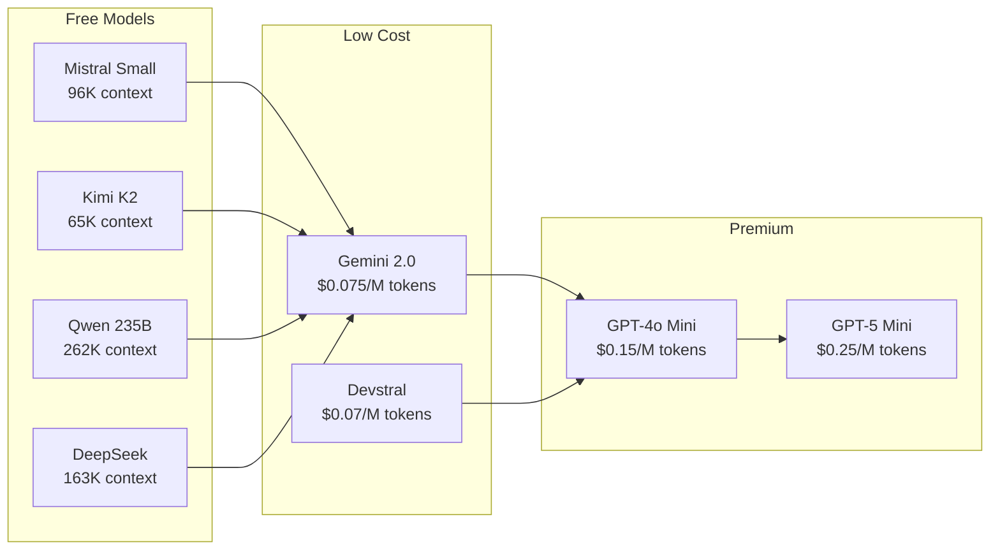

# Schema Documentation - Type-Safe Data Structures

## 📋 Overview

**Status**: Production Ready  
**Purpose**: Type-safe schema definitions for data validation, LLM interactions, and API contracts throughout the Web Content Filtering system.

## 🏗️ Schema Architecture



## 🔧 Core Schema: Schema__Text__Rating

### Definition

```python
from osbot_utils.type_safe.Type_Safe import Type_Safe

class Schema__Text__Rating(Type_Safe):
    """Represents the rating assessment of a text with sentiment and topic."""
    hash      : str = None  # Hash of text item
    positivity: float       # Positivity rating from 0 (negative) to 1 (positive), 0.5 is neutral
    topic     : str         # Main topic or subject of the text
```

### Data Flow



### Validation Rules

| Field | Type | Constraints | Description |
|-------|------|-------------|-------------|
| `hash` | str | 10 chars, alphanumeric | MD5 hash truncated |
| `positivity` | float | 0.0 ≤ x ≤ 1.0 | Sentiment score |
| `topic` | str | Max 100 chars | Primary topic/theme |

### Usage Examples

```python
# Creating a rating
rating = Schema__Text__Rating(
    hash="a1b2c3d4e5",
    positivity=0.75,
    topic="Technology News"
)

# Validation
assert 0 <= rating.positivity <= 1
assert len(rating.hash) == 10

# Serialization
rating_json = rating.json()
# {"hash": "a1b2c3d4e5", "positivity": 0.75, "topic": "Technology News"}

# Deserialization
rating_from_json = Schema__Text__Rating.from_json(rating_json)
```

## 📊 Container Schema: Schema__Text__Ratings

### Definition

```python
from typing import List

class Schema__Text__Ratings(Type_Safe):
    ratings: List[Schema__Text__Rating]
```

### Structure



### Batch Processing Examples

```python
# Create multiple ratings
ratings = Schema__Text__Ratings(
    ratings=[
        Schema__Text__Rating(hash="hash1", positivity=0.8, topic="Product Review"),
        Schema__Text__Rating(hash="hash2", positivity=0.3, topic="Complaint"),
        Schema__Text__Rating(hash="hash3", positivity=0.5, topic="News")
    ]
)

# Filter by sentiment
positive_ratings = [r for r in ratings.ratings if r.positivity > 0.6]
negative_ratings = [r for r in ratings.ratings if r.positivity < 0.4]

# Group by topic
from collections import defaultdict
by_topic = defaultdict(list)
for rating in ratings.ratings:
    by_topic[rating.topic].append(rating)
```

## 🤖 LLM Models Schema: Schema__WCF__LLM__Supported_Models

### Enum Definition

```python
from enum import Enum

class Schema__WCF__LLM__Supported_Models(Enum):
    # Free Tier Models
    Mistral_AI__Mistral_Small__Free = "mistralai/mistral-small-3.2-24b-instruct:free"
    Moonshot_AI__Kimi_K2__Free      = "moonshotai/kimi-k2:free"
    Qwen__Qwen3__235b__Free         = "qwen/qwen3-235b-a22b-07-25:free"
    TngTech__DeepSeek               = "tngtech/deepseek-r1t2-chimera:free"
    
    # Paid Models
    Google__Gemini_2_0              = "google/gemini-2.0-flash-lite-001"
    Mistral_AI__Devstral_Small      = "mistralai/devstral-small"
    Open_AI__GPT_4o_Mini            = "openai/gpt-4o-mini"
    Open_AI__GPT_4_1_Mini           = "openai/gpt-4.1-mini"
    Open_AI__GPT_5__Nano            = "openai/gpt-5-nano"
    Open_AI__GPT_5__Mini            = "openai/gpt-5-mini"
```

### Model Comparison Matrix



### Model Selection Logic

```python
def select_model(requirements):
    """Select appropriate model based on requirements"""
    
    if requirements.get('free_only'):
        if requirements.get('max_context') > 200000:
            return Schema__WCF__LLM__Supported_Models.Qwen__Qwen3__235b__Free
        else:
            return Schema__WCF__LLM__Supported_Models.Mistral_AI__Mistral_Small__Free
    
    if requirements.get('quality') == 'premium':
        if requirements.get('budget') > 1.0:
            return Schema__WCF__LLM__Supported_Models.Open_AI__GPT_5__Mini
        else:
            return Schema__WCF__LLM__Supported_Models.Open_AI__GPT_4o_Mini
    
    # Default to free tier
    return Schema__WCF__LLM__Supported_Models.Mistral_AI__Mistral_Small__Free
```

## 🔄 Request/Response Schemas

### LLM Request Schema

```python
class Schema__LLM_Request(Type_Safe):
    model: str
    messages: List[Dict[str, str]]
    max_tokens: int = 1000
    temperature: float = 0.7
    function_call: Optional[Dict] = None
```

### LLM Response Schema

```python
class Schema__LLM_Response(Type_Safe):
    response_data: Dict
    cache_id: str
    model: str
    timestamp: str
    
    def get_content(self) -> str:
        """Extract text content from response"""
        return self.response_data['choices'][0]['message']['content']
    
    def get_function_call(self) -> Optional[Dict]:
        """Extract function call if present"""
        return self.response_data['choices'][0]['message'].get('function_call')
```

## 🎯 API Contract Schemas

### URL Analysis Request

```python
class Schema__URL_Analysis_Request(Type_Safe):
    url: str
    model: Schema__WCF__LLM__Supported_Models = None
    options: Dict = None
    
    def validate(self):
        """Validate URL format and options"""
        import re
        url_pattern = re.compile(r'https?://[^\s]+')
        if not url_pattern.match(self.url):
            raise ValueError(f"Invalid URL format: {self.url}")
        
        if self.options:
            valid_options = {'max_depth', 'timeout', 'cache_ttl'}
            invalid = set(self.options.keys()) - valid_options
            if invalid:
                raise ValueError(f"Invalid options: {invalid}")
```

### Content Filtering Response

```python
class Schema__Content_Filtering_Response(Type_Safe):
    original_url: str
    cache_id: str
    model_used: str
    filtering_applied: Dict
    statistics: Dict
    filtered_html: Optional[str] = None
    
    @property
    def total_text_nodes(self) -> int:
        return self.statistics.get('total_nodes', 0)
    
    @property
    def filtered_count(self) -> int:
        return self.statistics.get('filtered_nodes', 0)
    
    @property
    def average_sentiment(self) -> float:
        return self.statistics.get('avg_sentiment', 0.5)
```

## ⚡ Performance Optimizations

### Schema Caching

```python
from functools import lru_cache

class CachedSchema(Type_Safe):
    @lru_cache(maxsize=1000)
    def validate_cached(self):
        """Cache validation results for repeated schemas"""
        return self.validate()
    
    @classmethod
    @lru_cache(maxsize=100)
    def from_json_cached(cls, json_str: str):
        """Cache deserialization for common payloads"""
        return cls.from_json(json_str)
```

### Batch Validation

```python
def validate_batch(ratings: List[Schema__Text__Rating]) -> Tuple[List[bool], List[str]]:
    """Validate multiple ratings efficiently"""
    results = []
    errors = []
    
    for rating in ratings:
        try:
            rating.validate()
            results.append(True)
            errors.append(None)
        except Exception as e:
            results.append(False)
            errors.append(str(e))
    
    return results, errors
```

## 🛡️ Security Validations

### Input Sanitization

```python
class SecureSchema(Type_Safe):
    def sanitize_text(self, text: str) -> str:
        """Remove potentially harmful content"""
        import html
        import re
        
        # HTML escape
        text = html.escape(text)
        
        # Remove script tags
        text = re.sub(r'<script[^>]*>.*?</script>', '', text, flags=re.DOTALL)
        
        # Limit length
        MAX_LENGTH = 10000
        if len(text) > MAX_LENGTH:
            text = text[:MAX_LENGTH]
        
        return text
```

### Schema Validation Middleware

```python
from fastapi import HTTPException

async def validate_schema_middleware(request, call_next):
    """Validate all incoming request schemas"""
    try:
        # Parse request body
        body = await request.body()
        
        # Attempt to validate against known schemas
        if request.url.path.startswith('/html-graphs'):
            # Validate URL parameter
            url = request.query_params.get('url')
            if url and not url.startswith(('http://', 'https://')):
                raise HTTPException(status_code=400, detail="Invalid URL scheme")
        
        response = await call_next(request)
        return response
        
    except ValueError as e:
        raise HTTPException(status_code=422, detail=str(e))
```

## 🐛 Error Schemas

### Standard Error Response

```python
class Schema__Error_Response(Type_Safe):
    error: str
    detail: Optional[str] = None
    status_code: int
    timestamp: str
    request_id: Optional[str] = None
    
    @classmethod
    def from_exception(cls, exc: Exception, status_code: int = 500):
        """Create error response from exception"""
        import uuid
        from datetime import datetime
        
        return cls(
            error=exc.__class__.__name__,
            detail=str(exc),
            status_code=status_code,
            timestamp=datetime.utcnow().isoformat(),
            request_id=str(uuid.uuid4())
        )
```

## ✅ Best Practices

1. **Always Use Type_Safe Base**: Inherit from Type_Safe for automatic validation
2. **Define Constraints**: Specify valid ranges and formats
3. **Implement Custom Validation**: Add validate() methods for complex rules
4. **Use Enums for Fixed Values**: Like model names
5. **Cache Schema Operations**: For frequently used schemas
6. **Document Fields**: Include descriptions and examples
7. **Version Schemas**: Track schema evolution

## 🧪 Schema Testing

```python
import pytest
from mgraph_ai_web_content_filtering.wcf__fast_api.llms.Schema__Text__Rating import Schema__Text__Rating

class TestSchemas:
    def test_rating_validation(self):
        """Test rating schema validation"""
        # Valid rating
        rating = Schema__Text__Rating(
            hash="a1b2c3d4e5",
            positivity=0.5,
            topic="Test"
        )
        assert rating.validate()
        
        # Invalid positivity
        with pytest.raises(ValueError):
            invalid = Schema__Text__Rating(
                hash="test",
                positivity=1.5,  # Out of range
                topic="Test"
            )
            invalid.validate()
    
    def test_serialization_roundtrip(self):
        """Test JSON serialization/deserialization"""
        original = Schema__Text__Rating(
            hash="test123456",
            positivity=0.75,
            topic="Technology"
        )
        
        # Serialize
        json_data = original.json()
        
        # Deserialize
        restored = Schema__Text__Rating.from_json(json_data)
        
        # Verify
        assert restored.hash == original.hash
        assert restored.positivity == original.positivity
        assert restored.topic == original.topic
```

---

*Type-safe schema definitions for the MGraph-AI Web Content Filtering system*