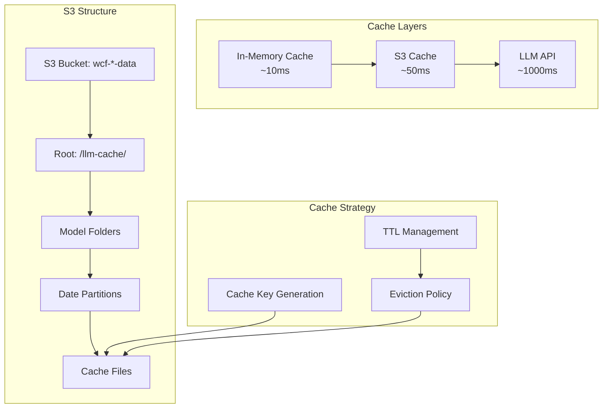
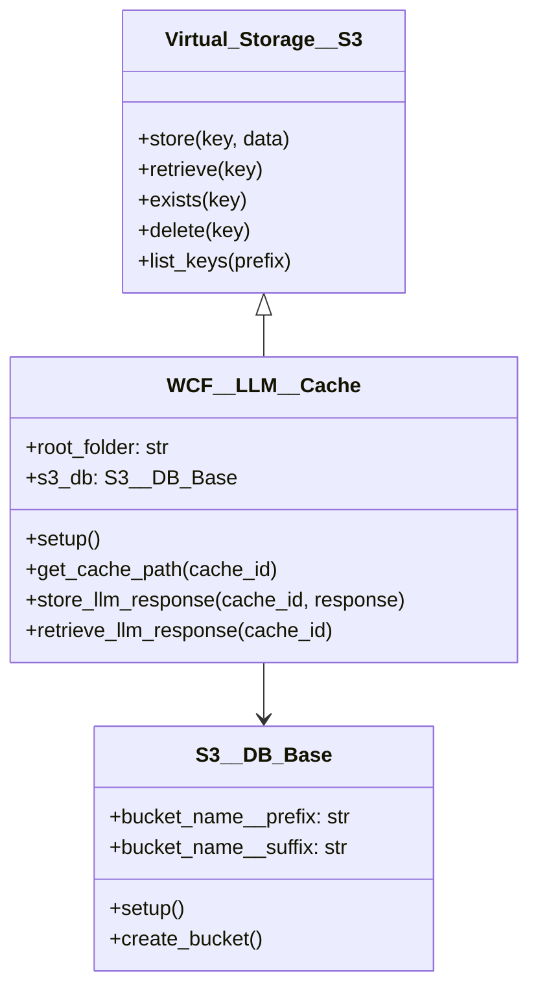
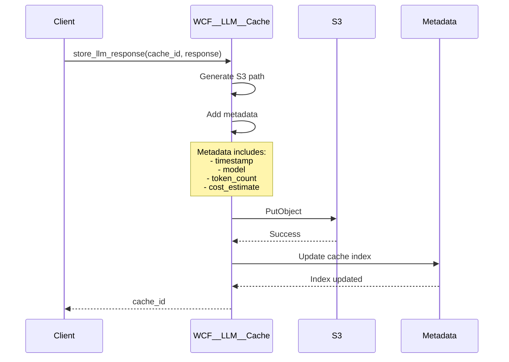
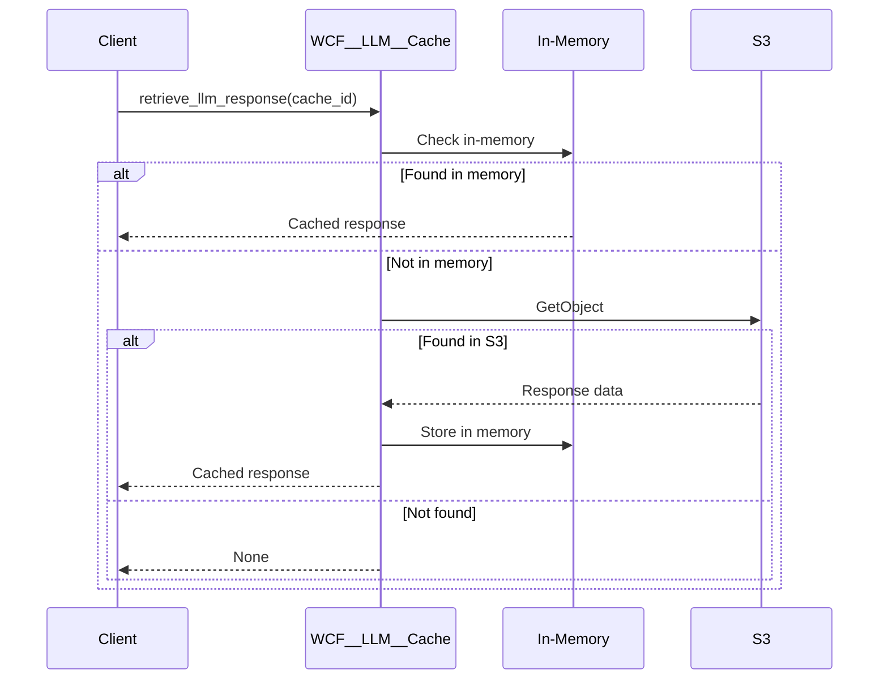

# WCF__LLM__Cache - Caching Architecture

## 📋 Overview

**Status**: Production Ready  
**Purpose**: S3-based virtual storage system for caching LLM responses, reducing API costs and improving response times through intelligent cache management.

## 🏗️ Cache Architecture



## 🔧 Class Structure

```python
class WCF__LLM__Cache(Virtual_Storage__S3):
    root_folder: Safe_Str__File__Path = 'llm-cache/'
    s3_db      : S3__DB_Base
    
    # Constants
    WCF__LLM__CACHE__DEFAULT__ROOT_FOLDER = 'llm-cache/'
    WCF__LLM__CACHE__BUCKET_NAME__PREFIX  = 'wcf'
    WCF__LLM__CACHE__BUCKET_NAME__SUFFIX  = 'data'
```

### Inheritance Hierarchy



## 📊 Cache Key Strategy

### Key Generation Algorithm

```python
def generate_cache_key(model: str, prompt: str, params: dict) -> str:
    """Generate deterministic cache key from request parameters"""
    import hashlib
    import json
    
    # Normalize parameters
    normalized = {
        'model': model,
        'prompt': prompt,
        'temperature': params.get('temperature', 0.7),
        'max_tokens': params.get('max_tokens', 1000),
        'top_p': params.get('top_p', 1.0)
    }
    
    # Create stable JSON representation
    key_string = json.dumps(normalized, sort_keys=True)
    
    # Generate MD5 hash
    cache_id = hashlib.md5(key_string.encode()).hexdigest()
    
    return cache_id
```

### S3 Path Structure

```
wcf-{env}-data/
├── llm-cache/
│   ├── mistralai-mistral-small/
│   │   ├── 2025/
│   │   │   ├── 01/
│   │   │   │   ├── 15/
│   │   │   │   │   ├── abc123def456.json
│   │   │   │   │   ├── def456ghi789.json
│   │   │   │   │   └── ...
│   │   │   │   └── ...
│   │   │   └── ...
│   │   └── ...
│   ├── openai-gpt-4o-mini/
│   │   └── ...
│   └── ...
```

**Benefits**:
- Date-based partitioning for lifecycle management
- Model-based separation for cost tracking
- Hierarchical structure for efficient listing

## 🔄 Cache Operations

### Store Operation



### Retrieve Operation



## ⚡ Performance Optimization

### Multi-Level Caching

```python
from functools import lru_cache
from typing import Optional, Dict
import time

class OptimizedCache(WCF__LLM__Cache):
    def __init__(self):
        super().__init__()
        self._memory_cache = {}
        self._cache_stats = {
            'hits': 0,
            'misses': 0,
            'memory_hits': 0,
            's3_hits': 0
        }
    
    @lru_cache(maxsize=100)
    def retrieve_with_memory(self, cache_id: str) -> Optional[Dict]:
        """Multi-level cache retrieval"""
        
        # Level 1: In-memory cache
        if cache_id in self._memory_cache:
            self._cache_stats['memory_hits'] += 1
            self._cache_stats['hits'] += 1
            return self._memory_cache[cache_id]
        
        # Level 2: S3 cache
        response = self.retrieve_llm_response(cache_id)
        if response:
            self._cache_stats['s3_hits'] += 1
            self._cache_stats['hits'] += 1
            # Populate memory cache
            self._memory_cache[cache_id] = response
            return response
        
        # Cache miss
        self._cache_stats['misses'] += 1
        return None
    
    def get_cache_stats(self) -> Dict:
        """Return cache performance statistics"""
        total = self._cache_stats['hits'] + self._cache_stats['misses']
        hit_rate = self._cache_stats['hits'] / total if total > 0 else 0
        
        return {
            'hit_rate': f"{hit_rate:.2%}",
            'total_requests': total,
            'memory_hits': self._cache_stats['memory_hits'],
            's3_hits': self._cache_stats['s3_hits'],
            'misses': self._cache_stats['misses']
        }
```

### Batch Operations

```python
async def batch_retrieve(self, cache_ids: List[str]) -> Dict[str, Dict]:
    """Retrieve multiple cache entries efficiently"""
    import asyncio
    import aioboto3
    
    results = {}
    
    async with aioboto3.Session().client('s3') as s3:
        tasks = []
        for cache_id in cache_ids:
            path = self.get_cache_path(cache_id)
            task = s3.get_object(Bucket=self.bucket_name, Key=path)
            tasks.append((cache_id, task))
        
        responses = await asyncio.gather(*[t[1] for t in tasks])
        
        for (cache_id, _), response in zip(tasks, responses):
            if response:
                body = await response['Body'].read()
                results[cache_id] = json.loads(body)
    
    return results
```

## 💾 Cache Management

### TTL and Expiration

```python
class CacheWithTTL(WCF__LLM__Cache):
    DEFAULT_TTL = 86400 * 30  # 30 days
    
    def store_with_ttl(self, cache_id: str, response: Dict, ttl: int = None):
        """Store with time-to-live metadata"""
        ttl = ttl or self.DEFAULT_TTL
        
        metadata = {
            'timestamp': time.time(),
            'ttl': ttl,
            'expires_at': time.time() + ttl
        }
        
        response['_metadata'] = metadata
        self.store_llm_response(cache_id, response)
    
    def retrieve_if_fresh(self, cache_id: str) -> Optional[Dict]:
        """Retrieve only if not expired"""
        response = self.retrieve_llm_response(cache_id)
        
        if response and '_metadata' in response:
            expires_at = response['_metadata'].get('expires_at', 0)
            if time.time() < expires_at:
                return response
            else:
                # Expired - optionally delete
                self.delete(cache_id)
        
        return None
```

### Cache Eviction Policies

```python
class CacheEvictionPolicy:
    """Implement various cache eviction strategies"""
    
    @staticmethod
    def lru_eviction(cache: WCF__LLM__Cache, max_size: int):
        """Least Recently Used eviction"""
        # List all cache entries with access times
        entries = cache.list_with_metadata()
        
        if len(entries) > max_size:
            # Sort by last access time
            sorted_entries = sorted(entries, key=lambda x: x['LastModified'])
            
            # Delete oldest entries
            to_delete = sorted_entries[max_size:]
            for entry in to_delete:
                cache.delete(entry['Key'])
    
    @staticmethod
    def size_based_eviction(cache: WCF__LLM__Cache, max_size_gb: float):
        """Evict based on total cache size"""
        total_size = cache.get_total_size()
        
        if total_size > max_size_gb * 1024 * 1024 * 1024:
            # Delete oldest until under limit
            entries = cache.list_with_metadata()
            sorted_entries = sorted(entries, key=lambda x: x['LastModified'])
            
            current_size = total_size
            for entry in sorted_entries:
                if current_size <= max_size_gb * 1024 * 1024 * 1024:
                    break
                cache.delete(entry['Key'])
                current_size -= entry['Size']
```

## 🛡️ Security Considerations

### Encryption

```python
class SecureCache(WCF__LLM__Cache):
    def __init__(self):
        super().__init__()
        # Configure S3 encryption
        self.encryption_config = {
            'Rules': [{
                'ApplyServerSideEncryptionByDefault': {
                    'SSEAlgorithm': 'AES256'
                }
            }]
        }
    
    def setup_bucket_encryption(self):
        """Enable S3 bucket encryption"""
        s3 = boto3.client('s3')
        s3.put_bucket_encryption(
            Bucket=self.bucket_name,
            ServerSideEncryptionConfiguration=self.encryption_config
        )
```

### Access Control

```python
def setup_bucket_policy(self):
    """Configure S3 bucket access policy"""
    policy = {
        "Version": "2012-10-17",
        "Statement": [
            {
                "Sid": "AllowLambdaAccess",
                "Effect": "Allow",
                "Principal": {
                    "AWS": "arn:aws:iam::account:role/lambda-execution-role"
                },
                "Action": [
                    "s3:GetObject",
                    "s3:PutObject",
                    "s3:DeleteObject"
                ],
                "Resource": f"arn:aws:s3:::{self.bucket_name}/llm-cache/*"
            }
        ]
    }
    
    s3 = boto3.client('s3')
    s3.put_bucket_policy(
        Bucket=self.bucket_name,
        Policy=json.dumps(policy)
    )
```

## 📊 Monitoring & Metrics

### Cache Metrics

```python
class CacheMetrics:
    def __init__(self, cache: WCF__LLM__Cache):
        self.cache = cache
        self.cloudwatch = boto3.client('cloudwatch')
    
    def publish_metrics(self):
        """Publish cache metrics to CloudWatch"""
        stats = self.cache.get_cache_stats()
        
        metrics = [
            {
                'MetricName': 'CacheHitRate',
                'Value': float(stats['hit_rate'].strip('%')) / 100,
                'Unit': 'None'
            },
            {
                'MetricName': 'CacheMisses',
                'Value': stats['misses'],
                'Unit': 'Count'
            },
            {
                'MetricName': 'CacheSize',
                'Value': self.cache.get_total_size() / (1024 * 1024),
                'Unit': 'Megabytes'
            }
        ]
        
        self.cloudwatch.put_metric_data(
            Namespace='WCF/Cache',
            MetricData=metrics
        )
```

### Cost Analysis

```python
def calculate_cache_savings(cache_stats: Dict, model_costs: Dict) -> Dict:
    """Calculate cost savings from caching"""
    
    # Example model costs per 1M tokens
    model_costs = {
        'openai/gpt-4o-mini': 0.15,
        'mistralai/mistral-small': 0.0,  # Free tier
        'google/gemini-2.0': 0.075
    }
    
    # Estimate tokens saved (avg 500 tokens per request)
    tokens_saved = cache_stats['hits'] * 500
    
    # Calculate savings per model
    savings = {}
    for model, cost_per_million in model_costs.items():
        cost_saved = (tokens_saved / 1_000_000) * cost_per_million
        savings[model] = f"${cost_saved:.2f}"
    
    # S3 storage cost (negligible compared to LLM costs)
    storage_cost = 0.023 * (cache_stats['total_size_gb'])  # $0.023 per GB/month
    
    return {
        'tokens_saved': tokens_saved,
        'potential_savings': savings,
        'storage_cost': f"${storage_cost:.2f}/month",
        'net_savings': f"${sum(float(s.strip(')) for s in savings.values()) - storage_cost:.2f}"
    }
```

## 🐛 Troubleshooting

### Common Issues

| Issue | Cause | Solution |
|-------|-------|----------|
| Cache misses | Key mismatch | Verify key generation logic |
| Slow retrieval | Large objects | Implement compression |
| High S3 costs | No eviction | Implement TTL/LRU eviction |
| Permission errors | IAM misconfiguration | Review bucket policies |

### Debug Utilities

```python
def debug_cache(cache: WCF__LLM__Cache):
    """Debug cache operations"""
    
    # Test connectivity
    try:
        cache.s3_db.client.head_bucket(Bucket=cache.bucket_name)
        print("✓ S3 bucket accessible")
    except Exception as e:
        print(f"✗ S3 access error: {e}")
    
    # List recent cache entries
    recent = cache.list_keys(limit=10)
    print(f"Recent cache entries: {len(recent)}")
    
    # Check cache hit rate
    stats = cache.get_cache_stats()
    print(f"Cache hit rate: {stats['hit_rate']}")
    
    # Verify cache integrity
    sample_id = recent[0] if recent else None
    if sample_id:
        data = cache.retrieve_llm_response(sample_id)
        print(f"✓ Sample retrieval successful" if data else "✗ Retrieval failed")
```

## ✅ Best Practices

1. **Implement TTL**: Prevent stale data accumulation
2. **Monitor Hit Rates**: Aim for >80% cache hits
3. **Compress Large Responses**: Reduce storage costs
4. **Use Lifecycle Policies**: Automate old data deletion
5. **Implement Warming**: Pre-cache common queries
6. **Secure Access**: Use IAM roles, not keys
7. **Track Costs**: Monitor both storage and API savings

---

*S3-based caching system for the MGraph-AI Web Content Filtering LLM responses*