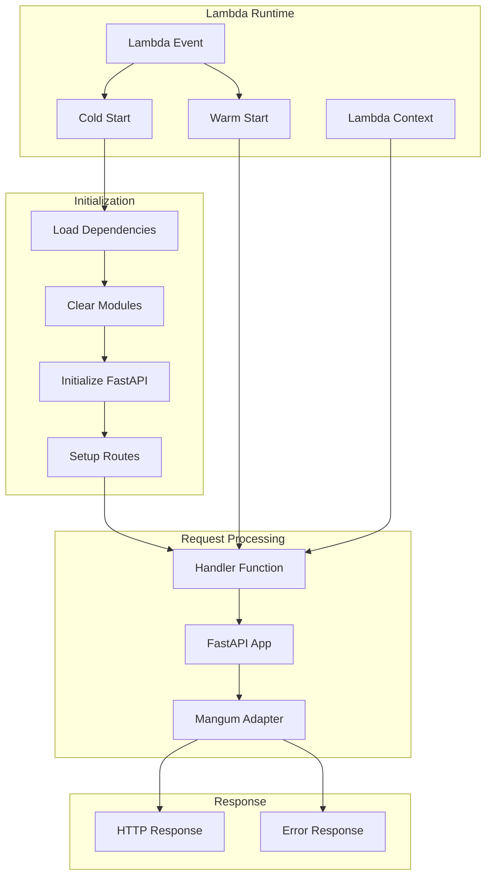
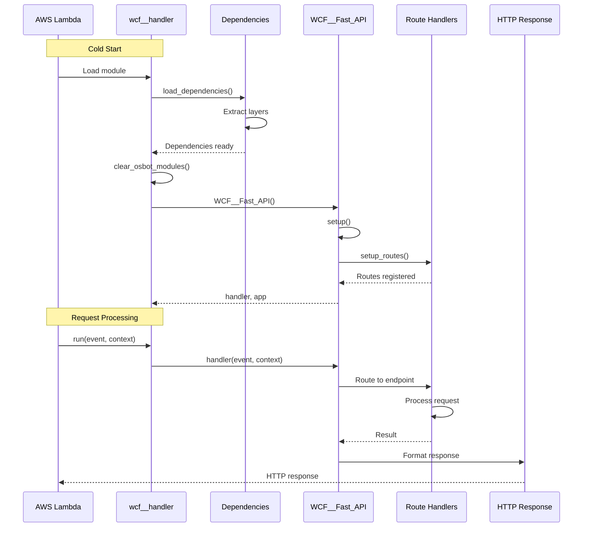
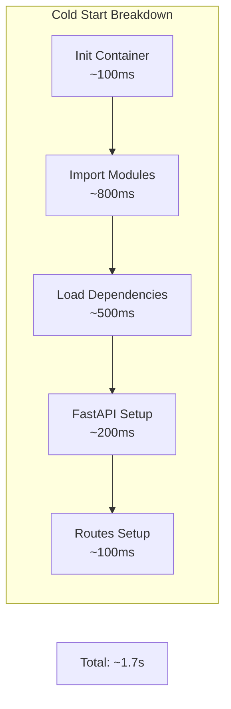

# wcf__handler - AWS Lambda Handler

## 📋 Overview

**Status**: Production Ready  
**Purpose**: Entry point for AWS Lambda execution, managing dependencies, FastAPI initialization, and request routing for the Web Content Filtering service.

## 🏗️ Handler Architecture



## 🔧 Handler Components

### Dependency Loading

```python
from osbot_aws.aws.lambda_.boto3__lambda import load_dependencies

LAMBDA_DEPENDENCIES = ['osbot-fast-api-serverless']

load_dependencies(LAMBDA_DEPENDENCIES)
```

**Purpose**: Loads Lambda layers and dependencies at runtime
**Timing**: Only during cold starts
**Impact**: Adds ~500ms to cold start time

### Module Cleanup

```python
def clear_osbot_modules():
    """Remove osbot_aws modules after initialization"""
    import sys
    for module in list(sys.modules):
        if module.startswith('osbot_aws'):
            del sys.modules[module]
```

**Why**: Reduces memory footprint after dependency loading
**Benefit**: Saves ~20MB RAM

### FastAPI Initialization

```python
from mgraph_ai_web_content_filtering.wcf__fast_api.WCF__Fast_API import WCF__Fast_API

with WCF__Fast_API() as _:
    _.setup()
    handler = _.handler()
    app     = _.app()
```

**Context Manager Benefits**:
- Ensures proper cleanup
- Handles initialization errors
- Manages resource lifecycle

## 📊 Lambda Execution Flow



## 🎯 Handler Function

```python
def run(event, context=None):
    return handler(event, context)
```

### Event Structure

```python
# API Gateway v2 Event
{
    "version": "2.0",
    "routeKey": "GET /html-graphs/url-to-html",
    "rawPath": "/html-graphs/url-to-html",
    "rawQueryString": "url=https://example.com",
    "headers": {
        "accept": "text/html",
        "content-type": "application/json",
        "host": "xxx.lambda-url.region.on.aws",
        "user-agent": "Mozilla/5.0..."
    },
    "requestContext": {
        "accountId": "123456789012",
        "apiId": "xxx",
        "domainName": "xxx.lambda-url.region.on.aws",
        "http": {
            "method": "GET",
            "path": "/html-graphs/url-to-html",
            "protocol": "HTTP/1.1",
            "sourceIp": "1.2.3.4",
            "userAgent": "Mozilla/5.0..."
        },
        "requestId": "xxx",
        "stage": "$default",
        "time": "08/Aug/2025:10:00:00 +0000",
        "timeEpoch": 1723108800000
    },
    "queryStringParameters": {
        "url": "https://example.com"
    },
    "isBase64Encoded": false
}
```

### Context Structure

```python
{
    "function_name": "web-content-filtering",
    "function_version": "$LATEST",
    "invoked_function_arn": "arn:aws:lambda:region:account:function:name",
    "memory_limit_in_mb": "512",
    "aws_request_id": "xxx-xxx-xxx",
    "log_group_name": "/aws/lambda/web-content-filtering",
    "log_stream_name": "2025/08/08/[$LATEST]xxx",
    "remaining_time_in_millis": 29000
}
```

## ⚡ Performance Optimization

### Cold Start Analysis



### Warm Start Optimization

```python
# Global scope - persists across invocations
_handler_instance = None
_app_instance = None

def get_or_create_handler():
    global _handler_instance, _app_instance
    
    if _handler_instance is None:
        with WCF__Fast_API() as api:
            api.setup()
            _handler_instance = api.handler()
            _app_instance = api.app()
    
    return _handler_instance

def run(event, context=None):
    handler = get_or_create_handler()
    return handler(event, context)
```

**Benefits**:
- Reuses handler across warm invocations
- Reduces initialization overhead
- Maintains connection pools

## 🛡️ Error Handling

### Lambda-Level Error Handling

```python
def run(event, context=None):
    try:
        return handler(event, context)
    except Exception as e:
        import traceback
        
        # Log full error
        print(f"Error in handler: {str(e)}")
        print(traceback.format_exc())
        
        # Return Lambda error response
        return {
            'statusCode': 500,
            'headers': {'content-type': 'application/json'},
            'body': json.dumps({
                'error': 'Internal Server Error',
                'message': str(e),
                'request_id': context.aws_request_id if context else None
            })
        }
```

### Timeout Handling

```python
def run_with_timeout_check(event, context):
    """Monitor remaining time and handle gracefully"""
    import time
    
    start_time = time.time()
    
    # Check remaining time
    if context and hasattr(context, 'get_remaining_time_in_millis'):
        remaining = context.get_remaining_time_in_millis()
        
        if remaining < 5000:  # Less than 5 seconds
            return {
                'statusCode': 503,
                'body': json.dumps({'error': 'Insufficient time remaining'})
            }
    
    # Process request
    response = handler(event, context)
    
    # Log execution time
    duration = time.time() - start_time
    print(f"Request processed in {duration:.2f}s")
    
    return response
```

## 📊 Memory Management

### Memory Profiling

```python
import tracemalloc

def profile_memory():
    """Profile memory usage during execution"""
    tracemalloc.start()
    
    # ... handler execution ...
    
    current, peak = tracemalloc.get_traced_memory()
    print(f"Current memory: {current / 1024 / 1024:.1f}MB")
    print(f"Peak memory: {peak / 1024 / 1024:.1f}MB")
    
    tracemalloc.stop()
```

### Memory Optimization Strategies

1. **Clear unused modules** - Remove after initialization
2. **Garbage collection** - Force collection after large operations
3. **Stream processing** - Process large content in chunks
4. **Cache management** - Implement LRU caches with size limits

## 🔄 Local Development

### Local Testing Setup

```python
# test_handler_locally.py
from mgraph_ai_web_content_filtering.lambdas.wcf__handler import run

def test_local():
    # Create test event
    event = {
        'version': '2.0',
        'requestContext': {
            'http': {
                'method': 'GET',
                'path': '/html-graphs/url-to-html',
                'sourceIp': '127.0.0.1'
            }
        },
        'queryStringParameters': {
            'url': 'https://example.com'
        }
    }
    
    # Mock context
    class MockContext:
        aws_request_id = 'local-test-123'
        function_name = 'local-test'
        memory_limit_in_mb = '512'
        
        def get_remaining_time_in_millis(self):
            return 30000
    
    context = MockContext()
    
    # Run handler
    response = run(event, context)
    print(f"Status: {response['statusCode']}")
    print(f"Body: {response['body'][:200]}...")

if __name__ == "__main__":
    test_local()
```

### LocalStack Integration

```python
def run_using_localstack():
    """Configure for LocalStack testing"""
    from osbot_local_stack.local_stack.Local_Stack import Local_Stack
    from osbot_aws.testing.Temp__Random__AWS_Credentials import Temp_AWS_Credentials
    
    # Use LocalStack credentials
    Temp_AWS_Credentials().with_localstack_credentials()
    
    # Activate LocalStack
    local_stack = Local_Stack().activate()
    
    return local_stack

# Uncomment for LocalStack testing
# run_using_localstack()
```

## 🐛 Debugging

### CloudWatch Logging

```python
import logging
import json

# Configure logging
logger = logging.getLogger()
logger.setLevel(logging.INFO)

def run(event, context=None):
    # Log incoming event
    logger.info(f"Event: {json.dumps(event)}")
    
    if context:
        logger.info(f"Context: {context.function_name}, "
                   f"Request ID: {context.aws_request_id}, "
                   f"Memory: {context.memory_limit_in_mb}MB")
    
    try:
        response = handler(event, context)
        logger.info(f"Response status: {response.get('statusCode')}")
        return response
        
    except Exception as e:
        logger.error(f"Handler error: {str(e)}", exc_info=True)
        raise
```

### X-Ray Tracing

```python
from aws_xray_sdk.core import xray_recorder

@xray_recorder.capture('wcf_handler')
def run(event, context=None):
    # Add metadata
    xray_recorder.put_metadata('event_type', event.get('version'))
    xray_recorder.put_metadata('path', event.get('rawPath'))
    
    # Trace subsegments
    with xray_recorder.in_subsegment('process_request'):
        response = handler(event, context)
    
    xray_recorder.put_metadata('status_code', response.get('statusCode'))
    return response
```

## ✅ Best Practices

1. **Minimize Cold Starts**: Keep handler lightweight
2. **Reuse Connections**: Maintain connection pools globally
3. **Handle Timeouts**: Check remaining time for long operations
4. **Log Strategically**: Balance detail with performance
5. **Error Recovery**: Implement retry logic where appropriate
6. **Memory Management**: Monitor and optimize memory usage
7. **Security**: Never log sensitive data

## 📈 Monitoring Metrics

Key metrics to monitor:

| Metric | Alert Threshold | Description |
|--------|----------------|-------------|
| Cold Start Rate | > 10% | Percentage of cold starts |
| Error Rate | > 1% | Failed invocations |
| Duration P99 | > 5s | 99th percentile latency |
| Memory Usage | > 80% | Memory utilization |
| Concurrent Executions | > 800 | Near limit warning |
| Throttles | > 0 | Rate limiting occurring |

## 🔗 Integration Points

- **Upstream**: API Gateway, EventBridge, Direct Invocation
- **Core**: WCF__Fast_API application
- **Dependencies**: Lambda Layers (osbot-fast-api-serverless)
- **Downstream**: S3 (cache), OpenRouter API (LLM)
- **Monitoring**: CloudWatch, X-Ray

---

*AWS Lambda handler for the MGraph-AI Web Content Filtering service*