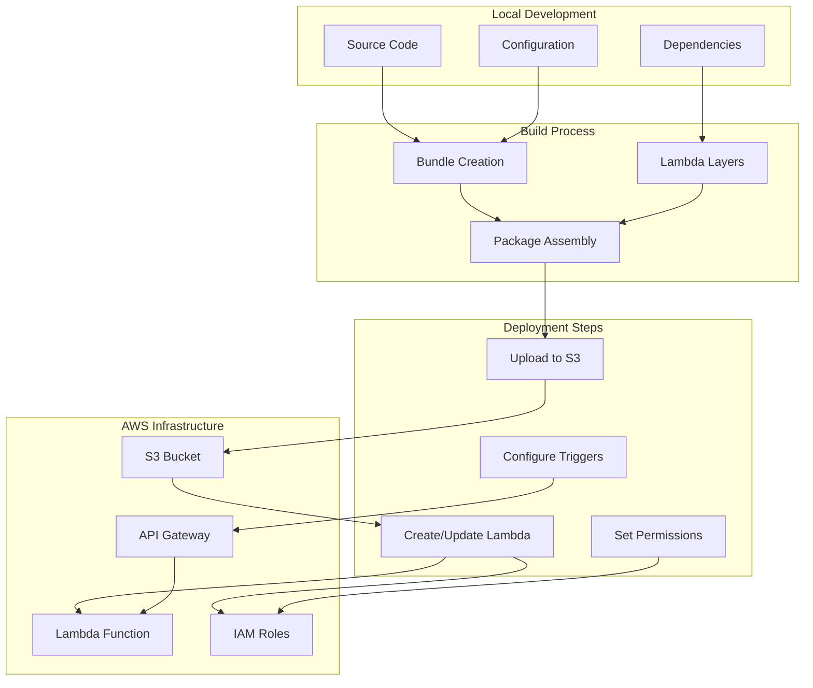
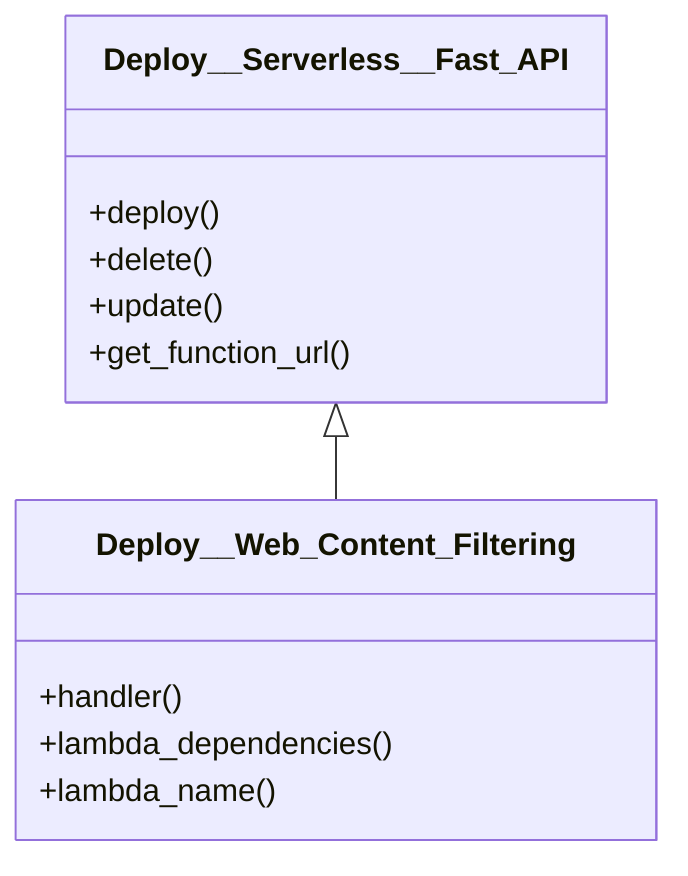
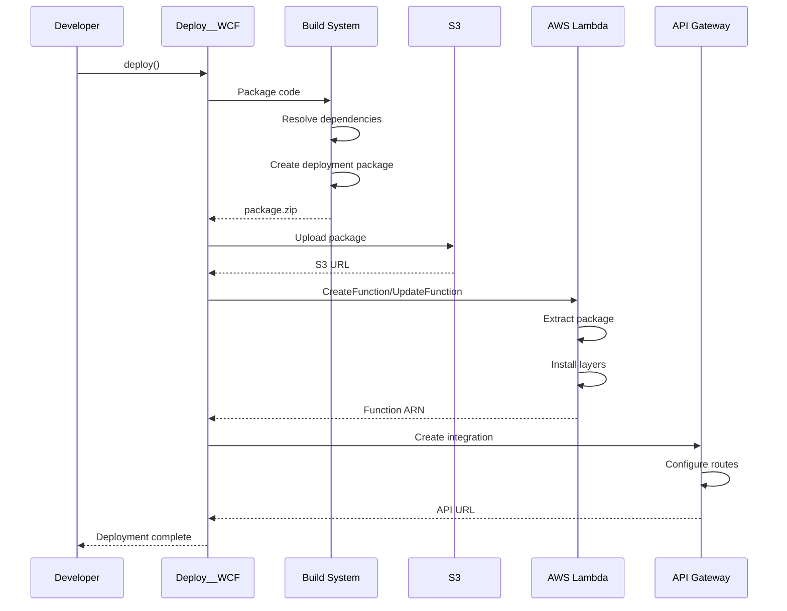
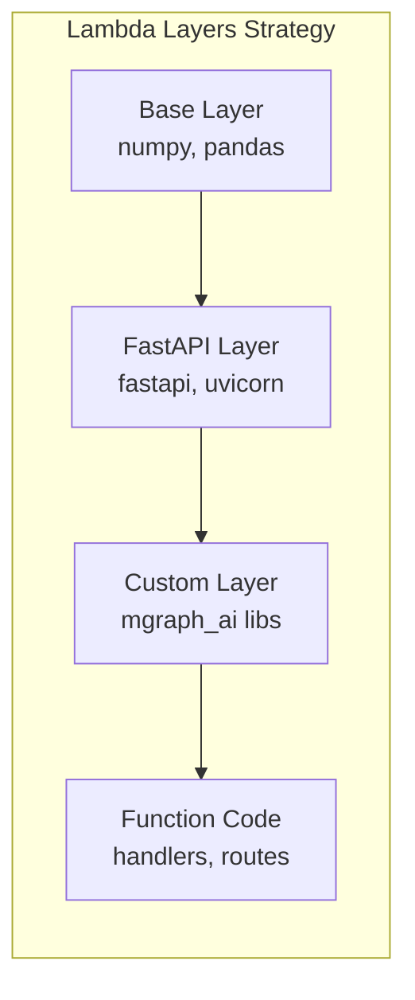

# Deploy__Web_Content_Filtering

## 📋 Overview

**Status**: Production Ready  
**Purpose**: Automated serverless deployment system for the Web Content Filtering application to AWS Lambda with all dependencies and configurations.

## 🏗️ Deployment Architecture



## 🔧 Class Structure

```python
class Deploy__Web_Content_Filtering(Deploy__Serverless__Fast_API):
    # Constants
    LAMBDA_NAME__WEB_CONTENT_FILTERING         = 'web-content-filtering'
    LAMBDA_DEPENDENCIES__WEB_CONTENT_FILTERING = ['osbot-fast-api-serverless']
    
    # Override methods
    def handler(self) -> Callable
    def lambda_dependencies(self) -> List[str]
    def lambda_name(self) -> str
```

### Inheritance Hierarchy



## 📊 Deployment Configuration

### Lambda Settings

| Configuration | Value | Description |
|--------------|-------|-------------|
| **Function Name** | `web-content-filtering` | Lambda function identifier |
| **Runtime** | Python 3.11 | Lambda runtime version |
| **Memory** | 512 MB | Allocated memory (configurable) |
| **Timeout** | 30 seconds | Max execution time |
| **Architecture** | x86_64 | Processor architecture |
| **Dependencies** | `osbot-fast-api-serverless` | Required Lambda layers |

### IAM Permissions Required

```json
{
    "Version": "2012-10-17",
    "Statement": [
        {
            "Effect": "Allow",
            "Action": [
                "s3:GetObject",
                "s3:PutObject",
                "s3:ListBucket"
            ],
            "Resource": [
                "arn:aws:s3:::wcf-*/*"
            ]
        },
        {
            "Effect": "Allow",
            "Action": [
                "logs:CreateLogGroup",
                "logs:CreateLogStream",
                "logs:PutLogEvents"
            ],
            "Resource": "arn:aws:logs:*:*:*"
        },
        {
            "Effect": "Allow",
            "Action": [
                "secretsmanager:GetSecretValue"
            ],
            "Resource": "arn:aws:secretsmanager:*:*:secret:open-router-api-key-*"
        }
    ]
}
```

## 🔄 Deployment Process



## 🎯 Usage Examples

### Basic Deployment

```python
from mgraph_ai_web_content_filtering.utils.deploy import Deploy__Web_Content_Filtering

# Initialize deployer
deployer = Deploy__Web_Content_Filtering()

# Deploy to AWS
result = deployer.deploy()
print(f"Lambda ARN: {result['FunctionArn']}")
print(f"Function URL: {deployer.get_function_url()}")
```

### Deployment with Custom Configuration

```python
# Custom memory and timeout
deployer = Deploy__Web_Content_Filtering()
deployer.memory_size = 1024  # 1GB RAM
deployer.timeout = 60  # 60 seconds

# Deploy with environment variables
deployer.environment_variables = {
    'LOG_LEVEL': 'DEBUG',
    'CACHE_TTL': '3600',
    'MAX_CONTENT_SIZE': '10485760'  # 10MB
}

deployer.deploy()
```

### Update Existing Deployment

```python
deployer = Deploy__Web_Content_Filtering()

# Update code only
deployer.update_code()

# Update configuration only
deployer.update_configuration()

# Full update
deployer.update()
```

### Rollback Deployment

```python
# Get current version
current_version = deployer.get_function_version()

# Deploy new version
deployer.deploy()

# If issues, rollback
deployer.rollback_to_version(current_version)
```

## ⚡ Performance Optimization

### Cold Start Mitigation

```python
class OptimizedDeploy(Deploy__Web_Content_Filtering):
    def configure_warmup(self):
        # Configure provisioned concurrency
        self.provisioned_concurrency = 5
        
        # Set up CloudWatch event for warm-up
        self.add_scheduled_warmup(rate="5 minutes")
```

### Layer Optimization



Benefits:
- Faster deployments (smaller code package)
- Better caching (layers are cached)
- Easier dependency management

## 🛡️ Security Best Practices

### 1. API Key Management

```python
def setup_secrets(self):
    """Store API keys in AWS Secrets Manager"""
    secrets_client = boto3.client('secretsmanager')
    
    secrets_client.create_secret(
        Name='open-router-api-key',
        SecretString=json.dumps({
            'api_key': os.environ['OPEN_ROUTER__API_KEY']
        })
    )
    
    # Grant Lambda access to secret
    self.add_secret_permission('open-router-api-key')
```

### 2. VPC Configuration

```python
def configure_vpc(self):
    """Deploy Lambda in VPC for network isolation"""
    self.vpc_config = {
        'SubnetIds': ['subnet-xxx', 'subnet-yyy'],
        'SecurityGroupIds': ['sg-zzz']
    }
```

### 3. Request Validation

```python
def add_api_gateway_validation(self):
    """Add request validation at API Gateway level"""
    self.api_request_validator = {
        'validateRequestBody': True,
        'validateRequestParameters': True
    }
```

## 📊 Monitoring & Logging

### CloudWatch Integration

```python
def setup_monitoring(self):
    """Configure CloudWatch dashboards and alarms"""
    
    # Create dashboard
    self.create_dashboard({
        'name': 'wcf-monitoring',
        'widgets': [
            'invocations',
            'errors',
            'duration',
            'concurrent_executions'
        ]
    })
    
    # Set up alarms
    self.create_alarm(
        name='high-error-rate',
        metric='Errors',
        threshold=10,
        period=300  # 5 minutes
    )
    
    self.create_alarm(
        name='high-latency',
        metric='Duration',
        threshold=5000,  # 5 seconds
        period=60
    )
```

### X-Ray Tracing

```python
def enable_tracing(self):
    """Enable AWS X-Ray for distributed tracing"""
    self.tracing_config = {
        'Mode': 'Active'
    }
    
    # Add X-Ray layer
    self.add_layer('arn:aws:lambda:region:901920570463:layer:aws-otel-python')
```

## 🔄 CI/CD Integration

### GitHub Actions Workflow

```yaml
name: Deploy WCF to Lambda

on:
  push:
    branches: [main]

jobs:
  deploy:
    runs-on: ubuntu-latest
    steps:
      - uses: actions/checkout@v2
      
      - name: Setup Python
        uses: actions/setup-python@v2
        with:
          python-version: '3.11'
      
      - name: Install dependencies
        run: |
          pip install -r requirements.txt
          pip install -r requirements-deploy.txt
      
      - name: Run tests
        run: pytest tests/
      
      - name: Deploy to Lambda
        env:
          AWS_ACCESS_KEY_ID: ${{ secrets.AWS_ACCESS_KEY_ID }}
          AWS_SECRET_ACCESS_KEY: ${{ secrets.AWS_SECRET_ACCESS_KEY }}
          OPEN_ROUTER__API_KEY: ${{ secrets.OPEN_ROUTER_API_KEY }}
        run: |
          python -m mgraph_ai_web_content_filtering.deploy
```

## 🐛 Troubleshooting

### Common Issues and Solutions

| Issue | Cause | Solution |
|-------|-------|----------|
| **Timeout errors** | Function exceeds 30s | Increase timeout or optimize code |
| **Memory errors** | Insufficient RAM | Increase memory_size to 1024MB+ |
| **Cold start latency** | First invocation slow | Enable provisioned concurrency |
| **Permission denied** | Missing IAM permissions | Review and update IAM role |
| **Package too large** | Dependencies > 250MB | Use Lambda layers |
| **API Gateway timeout** | Lambda takes > 29s | Implement async pattern |

### Debug Deployment

```python
def debug_deployment():
    deployer = Deploy__Web_Content_Filtering()
    
    # Enable verbose logging
    deployer.debug = True
    
    # Test local execution
    event = deployer.create_test_event('/html-graphs/url-to-html')
    response = deployer.invoke_local(event)
    print(f"Local response: {response}")
    
    # Validate package
    issues = deployer.validate_package()
    if issues:
        print(f"Package issues: {issues}")
    
    # Dry run deployment
    deployer.dry_run()
```

## ✅ Best Practices

1. **Version Everything**: Tag deployments with version numbers
2. **Blue-Green Deployments**: Use Lambda aliases for zero-downtime updates
3. **Resource Limits**: Set appropriate memory and timeout values
4. **Error Handling**: Implement proper error responses
5. **Monitoring**: Set up CloudWatch dashboards and alarms
6. **Testing**: Always test locally before deployment
7. **Rollback Plan**: Maintain previous versions for quick rollback

## 📈 Cost Optimization

### Pricing Calculation

```python
def calculate_monthly_cost(requests_per_month, avg_duration_ms):
    """Calculate estimated AWS Lambda costs"""
    
    # Lambda pricing (us-east-1)
    PRICE_PER_REQUEST = 0.0000002  # $0.20 per 1M requests
    PRICE_PER_GB_SECOND = 0.0000166667  # $0.0000166667 per GB-second
    
    # Calculation
    memory_gb = 512 / 1024  # 512MB in GB
    duration_seconds = avg_duration_ms / 1000
    
    request_cost = requests_per_month * PRICE_PER_REQUEST
    compute_cost = requests_per_month * duration_seconds * memory_gb * PRICE_PER_GB_SECOND
    
    total_cost = request_cost + compute_cost
    
    return {
        'request_cost': f"${request_cost:.2f}",
        'compute_cost': f"${compute_cost:.2f}",
        'total_cost': f"${total_cost:.2f}"
    }

# Example: 100K requests/month, 200ms average
costs = calculate_monthly_cost(100000, 200)
# Result: ~$2.67/month
```

---

*Deployment system for the MGraph-AI Web Content Filtering Lambda function*