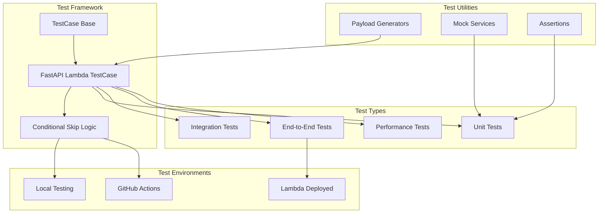
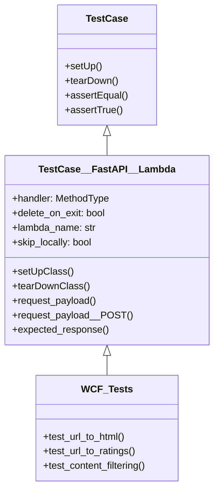
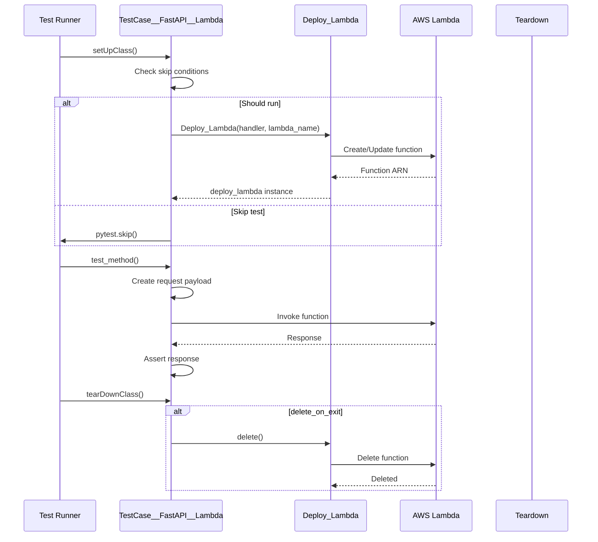
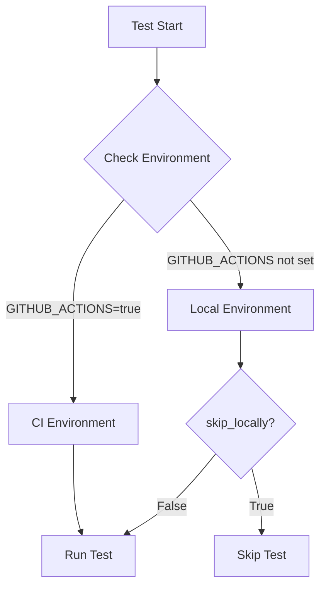

# TestCase__FastAPI__Lambda

## 📋 Overview

**Status**: Production Ready  
**Purpose**: Comprehensive testing framework for FastAPI Lambda functions with support for local and CI/CD testing, request/response validation, and automated deployment testing.

## 🏗️ Testing Architecture



## 🔧 Class Structure

```python
class TestCase__FastAPI__Lambda(TestCase):
    # Class attributes
    handler       : types.MethodType     # Lambda handler function
    delete_on_exit: bool = True          # Cleanup after tests
    lambda_name   : str  = None          # Lambda function name
    skip_locally  : bool = True          # Skip in local environment
    
    # Lifecycle methods
    @classmethod
    def setUpClass(cls) -> None
    
    @classmethod
    def tearDownClass(cls) -> None
    
    # Request builders
    def request_payload(self, path='/') -> dict
    def request_payload__POST(self, path='/', body=None, headers=None, is_base64_encoded=False) -> dict
    
    # Response validators
    def expected_response(self) -> dict
```

### Class Hierarchy



## 📊 Request Payload Generation

### GET Request Structure

```python
def request_payload(self, path='/'):
    payload = {
        'version': '2.0',
        'requestContext': {
            'http': {
                'method': 'GET',
                'path': path,
                'sourceIp': '127.0.0.1'
            }
        }
    }
    return payload
```

### POST Request Structure

```python
def request_payload__POST(self, path='/', body=None, headers=None, is_base64_encoded=False):
    payload = {
        'version': '2.0',
        'requestContext': {
            'http': {
                'method': 'POST',
                'path': path,
                'sourceIp': '127.0.0.1'
            }
        },
        'headers': headers or {},
        'rawPath': path,
        'rawQueryString': '',
        'isBase64Encoded': is_base64_encoded
    }
    
    if body is not None:
        if isinstance(body, dict):
            body_str = json.dumps(body)
            headers.setdefault('content-type', 'application/json')
        else:
            body_str = body
            
        if is_base64_encoded:
            payload['body'] = base64.b64encode(body_str.encode()).decode()
        else:
            payload['body'] = body_str
    
    return payload
```

## 🔄 Test Lifecycle



## 🎯 Usage Examples

### Basic Test Implementation

```python
from mgraph_ai_web_content_filtering.utils.testing import TestCase__FastAPI__Lambda
from mgraph_ai_web_content_filtering.lambdas.wcf__handler import run

class TestWCFLambda(TestCase__FastAPI__Lambda):
    handler = run
    lambda_name = 'test-wcf-lambda'
    
    def test_homepage(self):
        # Arrange
        payload = self.request_payload('/')
        
        # Act
        response = self.deploy_lambda.invoke(payload)
        
        # Assert
        self.assertEqual(response['statusCode'], 200)
        self.assertIn('message', response['body'])
```

### Testing Different Endpoints

```python
class TestWCFEndpoints(TestCase__FastAPI__Lambda):
    handler = run
    lambda_name = 'test-wcf-endpoints'
    
    def test_url_to_html(self):
        payload = self.request_payload('/html-graphs/url-to-html?url=https://example.com')
        response = self.deploy_lambda.invoke(payload)
        
        self.assertEqual(response['statusCode'], 200)
        self.assertEqual(response['headers']['content-type'], 'text/html')
        self.assertIn('<html', response['body'])
    
    def test_url_to_ratings(self):
        payload = self.request_payload('/html-graphs/url-to-ratings?url=https://example.com')
        response = self.deploy_lambda.invoke(payload)
        
        self.assertEqual(response['statusCode'], 200)
        body = json.loads(response['body'])
        self.assertIn('cache_id', body)
        self.assertIn('data', body)
        self.assertIn('ratings', body['data'])
    
    def test_post_with_json_body(self):
        body = {'url': 'https://example.com', 'options': {'max_depth': 10}}
        payload = self.request_payload__POST('/html-graphs/analyze', body=body)
        response = self.deploy_lambda.invoke(payload)
        
        self.assertEqual(response['statusCode'], 200)
```

### Testing with Base64 Encoding

```python
def test_binary_upload(self):
    # Simulate file upload
    file_content = b'Binary content here'
    headers = {'content-type': 'application/octet-stream'}
    
    payload = self.request_payload__POST(
        path='/upload',
        body=file_content,
        headers=headers,
        is_base64_encoded=True
    )
    
    response = self.deploy_lambda.invoke(payload)
    self.assertEqual(response['statusCode'], 200)
```

## ⚡ Performance Testing

```python
class TestWCFPerformance(TestCase__FastAPI__Lambda):
    handler = run
    lambda_name = 'test-wcf-performance'
    
    def test_response_time(self):
        """Ensure response time is under threshold"""
        import time
        
        payload = self.request_payload('/html-graphs/url-to-html')
        
        start = time.time()
        response = self.deploy_lambda.invoke(payload)
        duration = time.time() - start
        
        self.assertEqual(response['statusCode'], 200)
        self.assertLess(duration, 5.0, "Response took too long")
    
    def test_concurrent_requests(self):
        """Test handling of concurrent requests"""
        from concurrent.futures import ThreadPoolExecutor
        
        def make_request():
            payload = self.request_payload('/html-graphs/url-to-text-nodes')
            return self.deploy_lambda.invoke(payload)
        
        with ThreadPoolExecutor(max_workers=10) as executor:
            futures = [executor.submit(make_request) for _ in range(10)]
            responses = [f.result() for f in futures]
        
        for response in responses:
            self.assertEqual(response['statusCode'], 200)
    
    def test_memory_usage(self):
        """Monitor memory consumption"""
        payload = self.request_payload('/html-graphs/url-to-ratings?url=https://large-site.com')
        
        response = self.deploy_lambda.invoke(payload)
        
        # Check CloudWatch metrics (requires additional setup)
        metrics = self.get_lambda_metrics()
        self.assertLess(metrics['max_memory_used'], 256)  # MB
```

## 🛡️ Skip Test Logic

### Skip Conditions

```python
def skip__if_not__in_github_actions():
    """Skip test if not running in GitHub Actions"""
    import pytest
    from osbot_utils.utils.Env import not_in_github_action
    
    if not_in_github_action():
        pytest.skip('For performance reasons only run this test in GitHub Actions')
```

### Environment Detection



## 📊 Test Coverage Strategies

### Unit Test Coverage

```python
class TestWCFUnit(TestCase__FastAPI__Lambda):
    """Unit tests for individual components"""
    
    def test_text_extraction(self):
        """Test text extraction logic"""
        from mgraph_ai_web_content_filtering.wcf__fast_api.core import Html__Extract_Text_Nodes
        
        extractor = Html__Extract_Text_Nodes(url="test")
        extractor.html_dict = {"type": "element", "tag": "p", "nodes": [{"type": "text", "data": "Test"}]}
        
        result = extractor.extract()
        self.assertEqual(len(result), 1)
    
    def test_hash_generation(self):
        """Test text hashing"""
        # Test implementation
        pass
    
    def test_rating_schema(self):
        """Test rating schema validation"""
        # Test implementation
        pass
```

### Integration Test Coverage

```python
class TestWCFIntegration(TestCase__FastAPI__Lambda):
    """Integration tests for component interactions"""
    
    def test_full_pipeline(self):
        """Test complete processing pipeline"""
        # 1. Submit URL
        payload = self.request_payload('/html-graphs/url-to-html?url=https://test.com')
        html_response = self.deploy_lambda.invoke(payload)
        
        # 2. Extract text
        payload = self.request_payload('/html-graphs/url-to-text-nodes?url=https://test.com')
        text_response = self.deploy_lambda.invoke(payload)
        
        # 3. Get ratings
        payload = self.request_payload('/html-graphs/url-to-ratings?url=https://test.com')
        rating_response = self.deploy_lambda.invoke(payload)
        
        # 4. Apply filtering
        payload = self.request_payload('/html-graphs/url-to-html-min-rating?url=https://test.com&rating=0.3')
        filtered_response = self.deploy_lambda.invoke(payload)
        
        # Validate entire pipeline
        self.assertEqual(html_response['statusCode'], 200)
        self.assertEqual(text_response['statusCode'], 200)
        self.assertEqual(rating_response['statusCode'], 200)
        self.assertEqual(filtered_response['statusCode'], 200)
```

## 🐛 Debugging Tests

### Debug Utilities

```python
class TestDebugUtils:
    @staticmethod
    def print_response(response):
        """Pretty print Lambda response for debugging"""
        print(f"Status Code: {response['statusCode']}")
        print(f"Headers: {json.dumps(response['headers'], indent=2)}")
        
        if response.get('body'):
            try:
                body = json.loads(response['body'])
                print(f"Body: {json.dumps(body, indent=2)}")
            except:
                print(f"Body: {response['body'][:500]}...")
    
    @staticmethod
    def capture_logs(deploy_lambda):
        """Capture CloudWatch logs for test"""
        import boto3
        
        logs_client = boto3.client('logs')
        log_group = f"/aws/lambda/{deploy_lambda.lambda_name}"
        
        response = logs_client.filter_log_events(
            logGroupName=log_group,
            limit=100
        )
        
        for event in response['events']:
            print(event['message'])
```

### Test Fixtures

```python
import pytest

@pytest.fixture
def sample_html():
    return """
    <html>
        <head><title>Test Page</title></head>
        <body>
            <h1>Test Header</h1>
            <p>Test paragraph content</p>
        </body>
    </html>
    """

@pytest.fixture
def mock_llm_response():
    return {
        "cache_id": "test_cache_123",
        "model": "test-model",
        "data": {
            "ratings": [
                {"hash": "hash1", "positivity": 0.8, "topic": "Test"}
            ]
        }
    }

class TestWithFixtures(TestCase__FastAPI__Lambda):
    def test_with_mock_data(self, sample_html, mock_llm_response):
        # Use fixtures in tests
        pass
```

## ✅ Best Practices

1. **Test Isolation**: Each test should be independent
2. **Mock External Services**: Mock LLM calls for unit tests
3. **Use Fixtures**: Share common test data via fixtures
4. **Test Edge Cases**: Empty inputs, malformed data, timeouts
5. **Performance Benchmarks**: Set and monitor performance thresholds
6. **Clean Up Resources**: Always delete test Lambdas
7. **Parallel Testing**: Design tests to run concurrently

## 📈 CI/CD Integration

### GitHub Actions Test Configuration

```yaml
name: Run Tests

on: [push, pull_request]

jobs:
  test:
    runs-on: ubuntu-latest
    
    steps:
    - uses: actions/checkout@v2
    
    - name: Setup Python
      uses: actions/setup-python@v2
      with:
        python-version: '3.11'
    
    - name: Install dependencies
      run: |
        pip install -r requirements.txt
        pip install -r requirements-test.txt
    
    - name: Run unit tests
      run: pytest tests/unit/ -v
    
    - name: Run integration tests
      env:
        AWS_ACCESS_KEY_ID: ${{ secrets.AWS_ACCESS_KEY_ID }}
        AWS_SECRET_ACCESS_KEY: ${{ secrets.AWS_SECRET_ACCESS_KEY }}
        GITHUB_ACTIONS: true
      run: pytest tests/integration/ -v
    
    - name: Generate coverage report
      run: |
        pytest --cov=mgraph_ai_web_content_filtering tests/
        codecov
```

---

*Testing framework for the MGraph-AI Web Content Filtering Lambda functions*