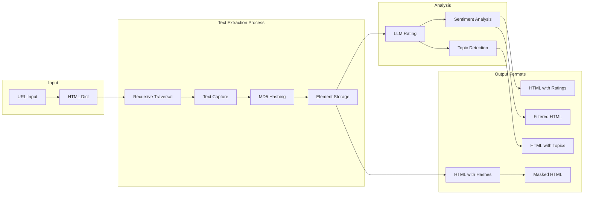
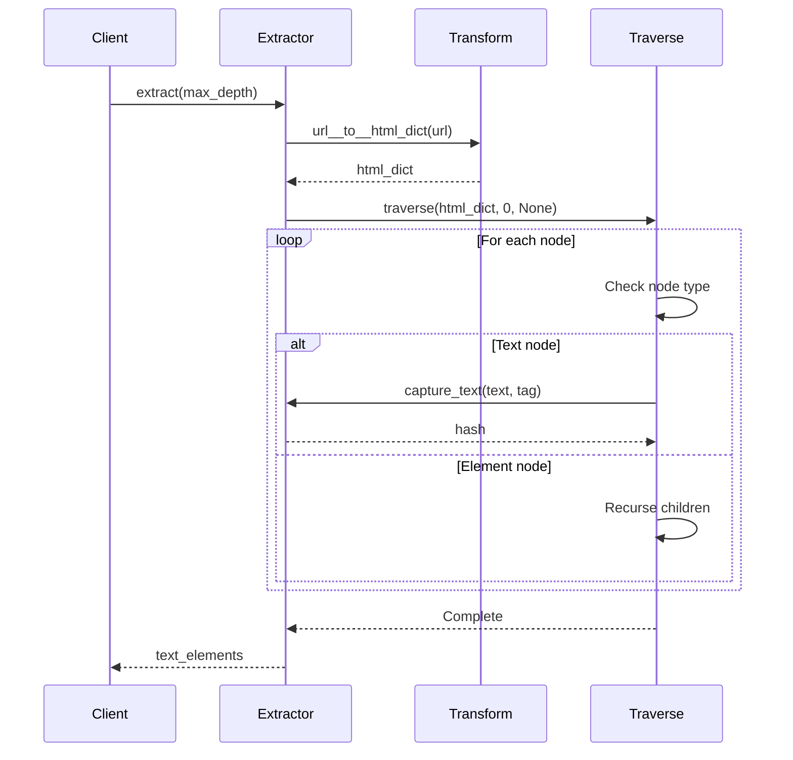
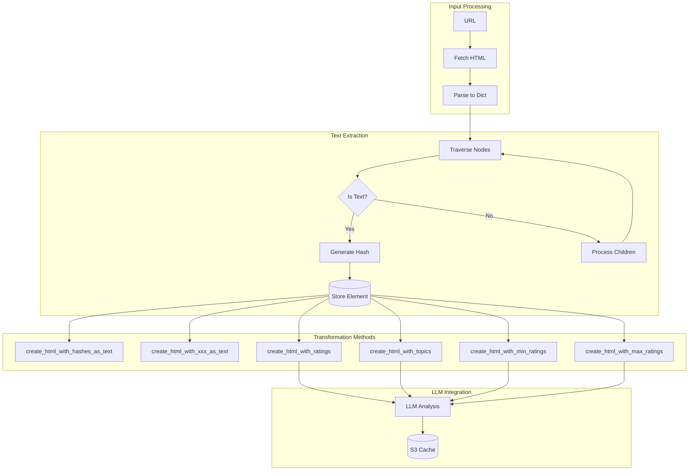

# Html__Extract_Text_Nodes

## 📋 Overview

**Status**: Production Ready  
**Purpose**: Extracts text nodes from HTML documents, generates unique hashes for each text element, and provides multiple transformation methods for content filtering and analysis.

## 🏗️ Architecture



## 🔧 Component Breakdown

### Class: `Html__Extract_Text_Nodes`

```python
class Html__Extract_Text_Nodes(Type_Safe):
    html_transformations: Html__Transformations  # HTML processing utilities
    html_dict           : Dict                   # Parsed HTML structure
    text_elements       : Dict                   # Processed text with metadata
    text_elements__raw  : Dict                   # Raw text mappings
    hash_size           = 10                     # MD5 hash truncation size
    captures            = 0                      # Counter for extracted texts
    max_depth           = 10                     # Maximum traversal depth
    url                 = str                    # Source URL
```

### Key Methods

#### `extract(max_depth=35) -> Dict`
Main extraction method that processes HTML and returns text elements.



#### `capture_text(text, tag) -> str`
Captures text content and generates unique hash identifier.

**Process**:
1. Generate MD5 hash of text content
2. Truncate to `hash_size` characters
3. Store raw text in `text_elements__raw`
4. Store metadata in `text_elements`
5. Return hash identifier

#### `traverse(node, depth, parent_tag)`
Recursive HTML tree traversal with depth limiting.

**Key Features**:
- Skips `<style>` and `<script>` tags
- Preserves parent tag context
- Depth-limited to prevent stack overflow
- Type-safe node processing

## 📊 Data Flow



## 🎯 Usage Examples

### Basic Text Extraction

```python
# Initialize extractor
extractor = Html__Extract_Text_Nodes(url="https://example.com")

# Extract text nodes
text_elements = extractor.extract(max_depth=35)

# Result structure
{
    "hash123abc": {
        "original_text": "Welcome to our website",
        "tag": "h1"
    },
    "hash456def": {
        "original_text": "This is a paragraph of content",
        "tag": "p"
    }
}
```

### Content Masking

```python
# Create HTML with text replaced by 'xxx'
masked_html = extractor.create_html_with_xxx_as_text()

# Original: <p>Sensitive content here</p>
# Masked:   <p>xxxxxxxxx xxxxxxx xxxx</p>
```

### Sentiment-Based Filtering

```python
# Filter out negative content (rating < 0.3)
positive_html = extractor.create_html_with_min_ratings(min_rating=0.3)

# Filter out overly positive content (rating > 0.7)
neutral_html = extractor.create_html_with_max_ratings(max_rating=0.7)
```

### Topic Analysis

```python
# Generate HTML with topic labels
topics_html = extractor.create_html_with_topics()

# Original: <p>Latest technology news about AI</p>
# With topics: <p>Technology/AI</p>
```

## ⚡ Performance Characteristics

| Operation | Time Complexity | Space Complexity | Typical Duration |
|-----------|----------------|------------------|------------------|
| Text Extraction | O(n) | O(n) | ~100ms |
| Hash Generation | O(m) | O(1) | ~1ms per text |
| HTML Reconstruction | O(n) | O(n) | ~50ms |
| LLM Rating (cached) | O(1) | O(1) | ~10ms |
| LLM Rating (fresh) | O(m) | O(m) | ~1000ms |

Where:
- n = number of HTML nodes
- m = number of text elements

## 🔒 Security Considerations

1. **Hash Collision**: MD5 with 10-char truncation has collision risk
   - Mitigation: Increase `hash_size` for critical applications
   
2. **Depth Limiting**: Prevents stack overflow attacks
   - Default: 35 levels deep
   - Configurable via `max_depth` parameter

3. **Script/Style Filtering**: Automatically excludes JavaScript and CSS
   - Prevents execution context confusion
   - Focuses on visible content only

## 🐛 Edge Cases

1. **Empty Text Nodes**: Filtered out via `.strip()` check
2. **Deep Nesting**: Limited by `max_depth` parameter
3. **Large Documents**: May hit memory limits with extremely large DOMs
4. **Special Characters**: Preserved in hashing, masked appropriately
5. **Whitespace Preservation**: Maintains spaces in masking operations

## ✅ Best Practices

1. **Cache LLM Results**: Always use the caching layer for production
2. **Adjust Hash Size**: Increase for large-scale deployments
3. **Monitor Depth**: Log warnings when max_depth is reached
4. **Batch Processing**: Group multiple URLs for efficiency
5. **Error Handling**: Wrap in try-catch for network failures

## 🧪 Testing Strategy

```python
def test_text_extraction():
    # Test with known HTML
    html = "<div><p>Test content</p></div>"
    extractor = Html__Extract_Text_Nodes(url="test")
    extractor.html_dict = parse_html(html)
    
    elements = extractor.extract()
    assert len(elements) == 1
    assert "Test content" in str(elements.values())

def test_depth_limiting():
    # Create deeply nested HTML
    deep_html = create_nested_html(depth=50)
    extractor = Html__Extract_Text_Nodes(url="test")
    extractor.max_depth = 10
    
    # Should stop at depth 10
    elements = extractor.extract()
    assert extractor.max_depth_reached == True
```

## 🔄 Integration Points

- **Upstream**: `Html__Transformations` for HTML fetching
- **Downstream**: `WCF__LLM__Execute_Request` for sentiment analysis
- **Cache Layer**: `WCF__LLM__Cache` for response persistence
- **API Layer**: `Routes__Html_Graphs` for REST endpoints

---

*Component of the MGraph-AI Web Content Filtering system*