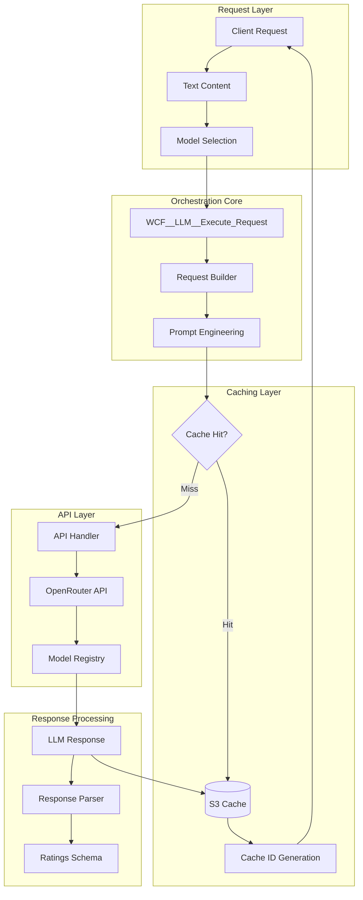
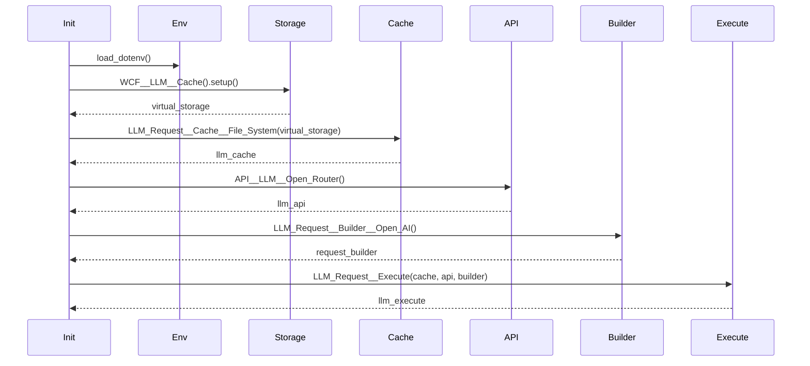
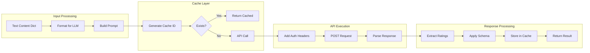
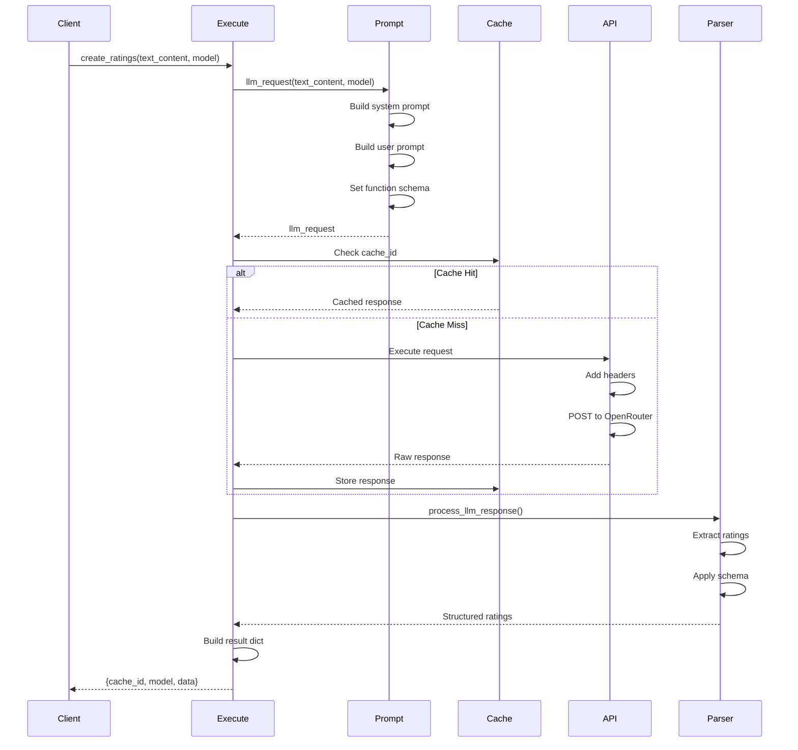

# WCF__LLM__Execute_Request

## 📋 Overview

**Status**: Production Ready  
**Purpose**: Orchestrates LLM requests for sentiment analysis and topic classification, managing model selection, caching, and API interactions with OpenRouter.

## 🏗️ Architecture



## 🔧 Component Breakdown

### Class: `WCF__LLM__Execute_Request`

```python
class WCF__LLM__Execute_Request(Type_Safe):
    virtual_storage: WCF__LLM__Cache = None  # S3-based cache storage
    
    # Core components initialized in __init__
    llm_cache       : LLM_Request__Cache__File_System
    llm_api         : API__LLM__Open_Router
    request_builder : LLM_Request__Builder__Open_AI
    llm_execute     : LLM_Request__Execute
    prompt_extract_rating: LLM__Prompt__Extract_Rating
```

### Initialization Flow



## 📊 Supported Models

The system supports multiple LLM models via OpenRouter with different cost/performance profiles:

| Model | Context | Input Cost | Output Cost | Use Case |
|-------|---------|------------|-------------|----------|
| Mistral Small (Free) | 96K | $0 | $0 | Default, testing |
| Moonshot Kimi K2 (Free) | 65K | $0 | $0 | Alternative free |
| Qwen 235B (Free) | 262K | $0 | $0 | Large context |
| Google Gemini 2.0 | 1M | $0.075/M | $0.30/M | High quality |
| OpenAI GPT-4o Mini | 128K | $0.15/M | $0.60/M | Balanced |
| OpenAI GPT-5 Mini | 400K | $0.25/M | $2.00/M | Premium |

## 🔄 Data Flow



## 🎯 Core Method: `create_ratings`

### Method Signature

```python
def create_ratings(
    self, 
    text_content, 
    model_to_use: Schema__WCF__LLM__Supported_Models = LLM__MODEL_TO_USE__DEFAULT
) -> dict
```

### Process Flow



## 💾 Caching Strategy

### Cache Key Generation

```python
# Cache ID is generated from:
# 1. Model name
# 2. Prompt content hash
# 3. Temperature settings
# 4. Max tokens

cache_id = md5(f"{model}:{prompt_hash}:{temp}:{max_tokens}")
```

### Cache Storage Structure

```
s3://wcf-data/
└── llm-cache/
    └── {model_name}/
        └── {year}/
            └── {month}/
                └── {day}/
                    └── {cache_id}.json
```

## 🚀 Usage Examples

### Basic Rating Generation

```python
# Initialize the executor
executor = WCF__LLM__Execute_Request()

# Simple text rating
text_content = {
    "hash1": {"original_text": "Great product!", "tag": "p"},
    "hash2": {"original_text": "Terrible service", "tag": "div"}
}

# Get ratings using default model
result = executor.create_ratings(text_content)

# Result structure
{
    "cache_id": "abc123def456",
    "model": "mistralai/mistral-small-3.2-24b-instruct:free",
    "data": {
        "ratings": [
            {"hash": "hash1", "positivity": 0.9, "topic": "Product Review"},
            {"hash": "hash2", "positivity": 0.1, "topic": "Service Complaint"}
        ]
    }
}
```

### Using Premium Models

```python
from mgraph_ai_web_content_filtering.wcf__fast_api.llms.Schema__WCF__LLM__Supported_Models import (
    Schema__WCF__LLM__Supported_Models
)

# Use GPT-4o Mini for better accuracy
result = executor.create_ratings(
    text_content,
    model_to_use=Schema__WCF__LLM__Supported_Models.Open_AI__GPT_4o_Mini
)
```

### Batch Processing

```python
# Process multiple URLs efficiently
urls = ["https://site1.com", "https://site2.com"]
all_ratings = {}

for url in urls:
    extractor = Html__Extract_Text_Nodes(url=url)
    text_elements = extractor.extract()
    
    # Ratings are automatically cached
    ratings = executor.create_ratings(text_elements)
    all_ratings[url] = ratings
```

## ⚡ Performance Metrics

| Operation | Latency (Cached) | Latency (Fresh) | Throughput |
|-----------|-----------------|-----------------|------------|
| Cache Check | ~5ms | - | 10,000/sec |
| Cache Retrieval | ~50ms | - | 1,000/sec |
| API Call (Free Model) | - | 500-1000ms | 10/sec |
| API Call (Premium) | - | 200-500ms | 20/sec |
| Response Parsing | ~10ms | ~10ms | 5,000/sec |

## 🔒 Security Considerations

1. **API Key Management**
   - Stored in environment variables
   - Never logged or exposed in responses
   - Rotated regularly

2. **Cache Security**
   - S3 bucket with encryption at rest
   - IAM role-based access control
   - No PII in cache keys

3. **Request Validation**
   - Type-safe schemas for all inputs
   - Text content sanitization
   - Model whitelist enforcement

## 🐛 Error Handling

```python
try:
    response = POST_json(url, headers=headers, data=llm_payload)
    return response
except HTTPError as error:
    # Parse error from OpenRouter
    error_message = str_to_json(error.file.read().decode("utf-8"))
    raise ValueError(error_message)
```

Common error scenarios:
- Rate limiting (429)
- Invalid API key (401)
- Model unavailable (503)
- Context length exceeded (400)

## ✅ Best Practices

1. **Always Use Caching**: Reduces costs and latency
2. **Model Selection**: Start with free models, upgrade as needed
3. **Batch Requests**: Group text elements for efficiency
4. **Monitor Usage**: Track API costs and cache hit rates
5. **Fallback Strategy**: Have backup models configured

## 🧪 Testing

```python
def test_rating_generation():
    executor = WCF__LLM__Execute_Request()
    
    test_content = {
        "test_hash": {
            "original_text": "This is a test",
            "tag": "p"
        }
    }
    
    result = executor.create_ratings(test_content)
    
    assert "cache_id" in result
    assert "model" in result
    assert "data" in result
    assert len(result["data"]["ratings"]) == 1
```

## 🔄 Integration Points

- **Upstream**: `Html__Extract_Text_Nodes` provides text content
- **Downstream**: `Routes__Html_Graphs` consumes ratings
- **Cache**: `WCF__LLM__Cache` for persistence
- **API**: `API__LLM__Open_Router` for model access
- **Prompts**: `LLM__Prompt__Extract_Rating` for prompt engineering

---

*Core component of the MGraph-AI Web Content Filtering LLM integration layer*