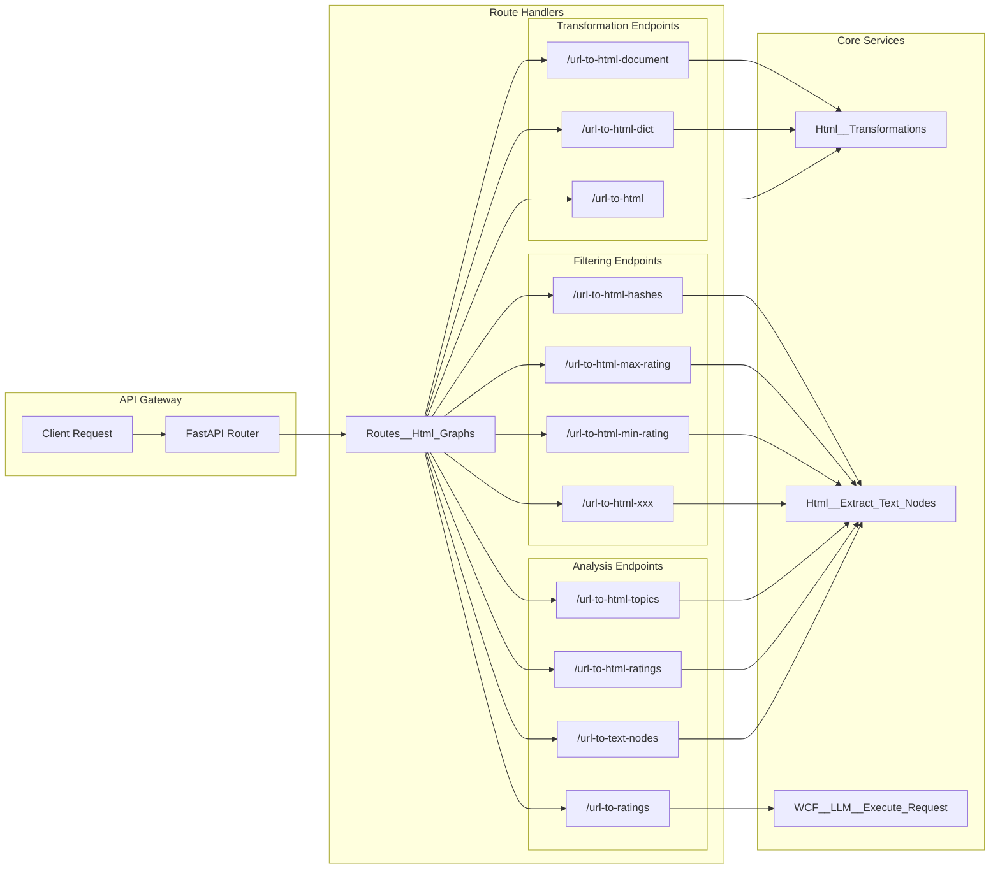
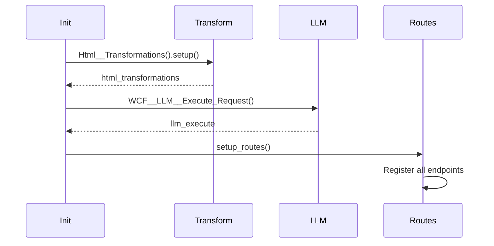
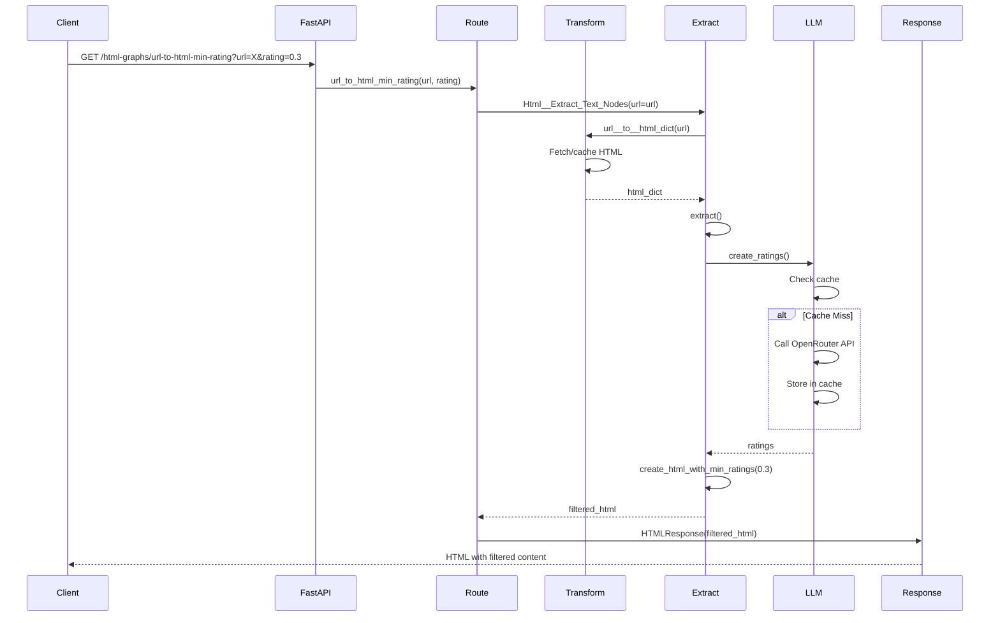

# Routes__Html_Graphs

## 📋 Overview

**Status**: Production Ready  
**Purpose**: Provides RESTful API endpoints for web content filtering operations, including HTML transformation, text extraction, sentiment analysis, and content filtering.

## 🏗️ API Architecture



## 🔧 Class Structure

```python
class Routes__Html_Graphs(Fast_API_Routes):
    tag                  : str                       = "html-graphs"
    html_transformations : Html__Transformations     = None
    llm_execute          : WCF__LLM__Execute_Request = None
```

### Initialization



## 📊 API Endpoints

### Transformation Endpoints

#### `GET /html-graphs/url-to-html`
Returns raw HTML content from URL.

**Parameters:**
- `url` (str): Target URL (default: BBC 404 page)

**Response:** HTML content (text/html)

```bash
curl "http://api/html-graphs/url-to-html?url=https://example.com"
```

---

#### `GET /html-graphs/url-to-html-dict`
Converts HTML to structured dictionary format.

**Parameters:**
- `url` (str): Target URL

**Response:** JSON dictionary representing HTML structure

```json
{
    "type": "element",
    "tag": "html",
    "nodes": [...]
}
```

---

#### `GET /html-graphs/url-to-html-document`
Returns parsed HTML document with metadata.

**Response Structure:**
```json
{
    "title": "Page Title",
    "meta": {...},
    "content": {...}
}
```

### Analysis Endpoints

#### `GET /html-graphs/url-to-text-nodes`
Extracts all text nodes with hashes.

**Response:**
```json
{
    "hash123": {
        "original_text": "Sample text",
        "tag": "p"
    }
}
```

---

#### `GET /html-graphs/url-to-ratings`
Generates sentiment ratings using LLM.

**Parameters:**
- `url` (str): Target URL
- `model_to_use` (enum): LLM model selection

**Response:**
```json
{
    "cache_id": "abc123",
    "model": "mistralai/mistral-small",
    "data": {
        "ratings": [
            {
                "hash": "hash123",
                "positivity": 0.7,
                "topic": "News"
            }
        ]
    }
}
```

### Filtering Endpoints

#### `GET /html-graphs/url-to-html-min-rating`
Filters content below rating threshold.

**Parameters:**
- `url` (str): Target URL
- `rating` (float): Minimum rating (0-1, default: 0.3)

**Behavior:**
- Content below threshold is masked with 'xxx'
- Content above threshold shows with rating

---

#### `GET /html-graphs/url-to-html-max-rating`
Filters content above rating threshold.

**Parameters:**
- `url` (str): Target URL  
- `rating` (float): Maximum rating (0-1, default: 0.3)

**Behavior:**
- Content above threshold is masked
- Content below threshold is preserved

## 🔄 Request Flow



## 🎯 Usage Examples

### Basic HTML Retrieval

```python
import requests

# Get HTML content
response = requests.get("http://api/html-graphs/url-to-html?url=https://news.site.com")
html_content = response.text
```

### Text Extraction with Analysis

```python
# Extract text nodes
response = requests.get("http://api/html-graphs/url-to-text-nodes?url=https://blog.com")
text_nodes = response.json()

# Get sentiment ratings
response = requests.get("http://api/html-graphs/url-to-ratings?url=https://blog.com")
ratings = response.json()

# Combine for analysis
for hash_id, rating in ratings['data']['ratings'].items():
    original_text = text_nodes[hash_id]['original_text']
    sentiment = rating['positivity']
    print(f"Text: {original_text[:50]}... | Sentiment: {sentiment}")
```

### Content Filtering Pipeline

```python
# Progressive filtering example
base_url = "http://api/html-graphs"
target = "https://news-site.com/article"

# 1. Get original content
original = requests.get(f"{base_url}/url-to-html?url={target}")

# 2. Filter negative content (< 0.3)
positive_only = requests.get(f"{base_url}/url-to-html-min-rating?url={target}&rating=0.3")

# 3. Filter extreme content (> 0.8)
moderate = requests.get(f"{base_url}/url-to-html-max-rating?url={target}&rating=0.8")

# 4. Show only topic labels
topics = requests.get(f"{base_url}/url-to-html-topics?url={target}")
```

## ⚡ Performance Characteristics

| Endpoint | Avg Response Time | Cache Hit | Cache Miss |
|----------|------------------|-----------|------------|
| /url-to-html | 100ms | 50ms | 200ms |
| /url-to-html-dict | 150ms | 75ms | 250ms |
| /url-to-text-nodes | 200ms | 100ms | 300ms |
| /url-to-ratings | 1500ms | 100ms | 2000ms |
| /url-to-html-min-rating | 1600ms | 150ms | 2100ms |

## 🔒 Security Considerations

1. **URL Validation**
   - Validates URL format
   - Prevents SSRF attacks
   - Timeout protection

2. **Rate Limiting**
   - Configurable per-endpoint limits
   - API key authentication available
   - DDoS protection at gateway level

3. **Content Security**
   - XSS prevention in HTML responses
   - Content-Type headers properly set
   - No execution of fetched scripts

## 🐛 Error Handling

```python
@app.exception_handler(ValueError)
async def value_error_handler(request: Request, exc: ValueError):
    return JSONResponse(
        status_code=400,
        content={"error": str(exc)}
    )

@app.exception_handler(HTTPException)
async def http_exception_handler(request: Request, exc: HTTPException):
    return JSONResponse(
        status_code=exc.status_code,
        content={"error": exc.detail}
    )
```

Common HTTP Status Codes:
- 200: Success
- 400: Bad Request (invalid URL)
- 404: URL not found
- 429: Rate limited
- 500: Internal server error
- 503: LLM service unavailable

## ✅ Best Practices

1. **Always Specify URLs**: Don't rely on default BBC 404 page
2. **Use Appropriate Endpoints**: Choose based on needed format
3. **Cache Warming**: Pre-process popular URLs
4. **Monitor Rate Limits**: Implement client-side throttling
5. **Handle Errors Gracefully**: Implement retry logic

## 🧪 Testing

```python
class TestRoutesHtmlGraphs:
    def test_url_to_html(self, client):
        response = client.get("/html-graphs/url-to-html?url=https://example.com")
        assert response.status_code == 200
        assert "html" in response.text.lower()
    
    def test_url_to_ratings(self, client):
        response = client.get("/html-graphs/url-to-ratings?url=https://example.com")
        assert response.status_code == 200
        data = response.json()
        assert "cache_id" in data
        assert "data" in data
        assert "ratings" in data["data"]
    
    def test_invalid_url(self, client):
        response = client.get("/html-graphs/url-to-html?url=not-a-url")
        assert response.status_code == 400
```

## 🔄 Integration with Lambda

The routes are deployed via AWS Lambda using the handler:

```python
from mgraph_ai_web_content_filtering.wcf__fast_api.WCF__Fast_API import WCF__Fast_API

with WCF__Fast_API() as app:
    app.setup()
    app.add_routes(Routes__Html_Graphs)
    handler = app.handler()
```

## 📈 Monitoring & Observability

Recommended metrics to track:
- Request latency per endpoint
- Cache hit rate
- LLM API usage and costs
- Error rates by type
- URL processing distribution

---

*REST API layer for the MGraph-AI Web Content Filtering system*